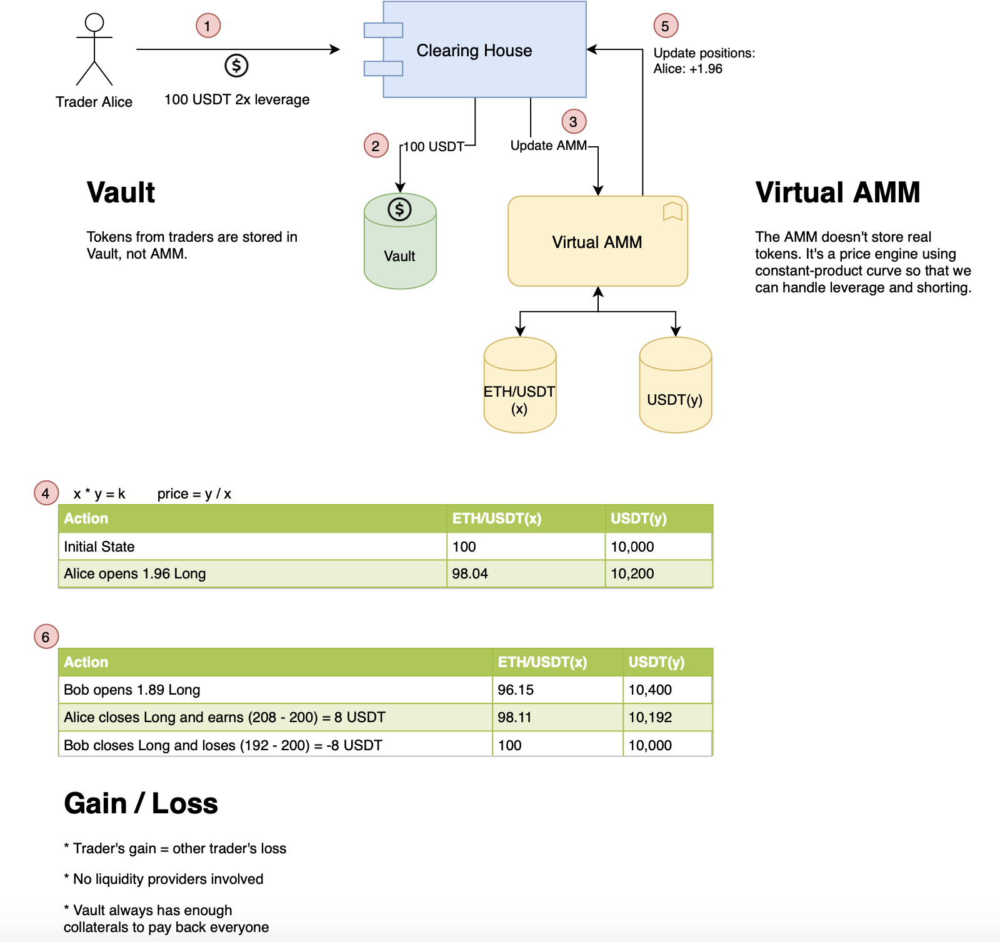

## Perpetual V1 

[白皮书](https://www.notion.so/Strike-Protocol-9049cc65e99246d886a230972d0cbd60) 
### 原理图


### 核心原理
在交易环节，以虚拟AMM定价，实际开仓/平仓的资金从资金池（Vault）进出，资金池中仅有USDC一种代币，开仓/平仓仅影响池中USDC数量；

在清算环节，由Chainlink喂价，保证金率低于6.5%时头寸将被清算，清算后的获利在保险基金与清算人之间分配。保险基金用于弥补行情剧烈波动时，平仓后穿仓的损失；  

Staking提供者在Perp上不作为流动性提供者，仅仅是保险基金的初始提供者，承担保险基金赔付时的损失风险，同时享有手续费收入。

**设计方案**
vAMM使用AMM的x*y=k方式定价，但不实际进行两种货币的兑换，而是由AMM公式提供价格后，从资金池（Vault）进出资金以代替直接从AMM池进出资金，实现单一货币的多/空头寸在Vault的开仓和平仓。
首先
假设Vault中原本有10,000 USDC， eth/usdc= 100, 则x=100，k=100 * 10000， 
1. Alice用100 U以2倍开多仓后变化如下， 
Alice将100U存入valut中，Perpetual Protocol 将 Alice 的 200 vDAI（100 DAI 的 10 倍杠杆）记入vAMM，作为回报，它根据常数函数 (x*y = k) 计算 Alice 收到的 vETH 数量。
Perpetual Protocol 记录 Alice 现在有 1.96 vETH，并且这个vAMM内部的状态变成了  98.04  vETH 和 10200 vDAI。


| 动作 | ETH | USDC | 计算|
| :-----| :---- | :---- | :---- |
| 初始状态 | 100 | 10000 | - |
| Alice开了1.96多仓 | 98.04 | 10200 | 100*10000/10200 |

2. 同样，如果此时Bob继续注入100 U以2倍杠杆开多仓后，vAMM公式将自动算出其持有多仓为1.89 ETH；

| 动作 | ETH | USDC | 计算|
| :-----| :---- | :---- | :---- |
| Bob开了1.89多仓 | 96.15 | 10400 | 98.04*10200/10400|
| Alice平了1.96多仓 | 98.11 | 10192 | 96.15*10400/98.115 |
| Bob平了1.89多仓 | 100 | 10000 | 98.11*10192/100 |

3. 如果 David 以100U以2倍杠杆开空仓。David 100u存入valut，
Perpetual Protocol 将 David 的 -200 vDAI 记入vAMM，作为回报，它根据常数函数 (x*y = k) 计算 Bob 收到的负 vETH 的数量。  
Perpetual Protocol 记录 David 现在已经做空了 2.04 vETH，并且这个vAMM内部的状态现在变成了 102.04 vETH 和 9800 vDAI。

| 动作 | ETH | USDC | 计算|
| :-----| :---- | :---- | :---- |
| Bob开了1.89多仓 | 96.15 | 10400 | 98.04*10200/10400|
| Alice平了1.96多仓 | 98.11 | 10192 | 96.15*10400/98.115 |
| Bob平了1.89多仓 | 100 | 10000 | 98.11*10192/100 |
| David开了2.04空仓 | 102.04  | 9800 | 100*10000/9800 |

- vault存放真实的usdc，而eth为虚拟出来的（根据K值计算）
- 做多则eth持仓为正，做空则eth持仓未负。 而池子数量一直为正，池子里为记账符号。
- 从实质上看，按照AMM的含义，后买入者将比先买入者的成本更高，后卖出者将比先卖出者得到更低的对价（换回更少的U），因此Alice获利而Bob损失，这一点在虚拟AMM中也同样体现。

**资金费率**
Perp上提供的是永续合约，每1小时收取一次资金费，按照加密货币衍生品交易所FTX的规则进行计算，公式如下：

FundingPayment（资金费）=PositionSize（仓位头寸）∗FundingRate（资金费率）

$\ fundingRate = \frac{P_{perp}- P_{index}}{24}$   

问题：都做多怎么办？？

**清算**
当保证金比例下降到6.25%或以下时，就会发生清算，这一规则即维持保证金（Maintenance Margin）。
清算由清算人的机器人出发，作为清算的奖励，清算人获得6.25%保证金中的1.25%，其余最高5%保证金存入协议保险基金。

**保险基金**
Perp V1协议赚取的交易费用，50%归Staking持币者，50%归入保险基金。当系统遭遇清算过程的损失和资金损失等意外损失是，保险基金将作为第一道防线首先支付这些损失。  

### 代码解析


核心合约是`clearingHouse`和`AMM`
几个关键变量：  
spotprice: 池子两个reserve相除     
margin:  usdc计（quoteAsset）  
positionNotional:   positionSize* spotPrice  
exchangedPositionSize : (做多正，做空负)   

用户操作主要跟`clearingHouse`交互  
### clearingHouse 合约解析
ClearingHouse 合约则复杂些，其管理着所有⽤户的持仓状态。对⽤户来说，核⼼业务的⽅法也⽐较多，主要
有：
- openPosition：开仓
- closePosition：平仓
- addMargin：增加保证⾦
- removeMargin：移除保证⾦
- openPositionWithReferral：带推荐码的开仓
- closePositionWithReferral：带推荐码的平仓
- adjustPosition：调整仓位
- liquidate：清算

个人持仓
```
    /// @notice This struct records personal position information
    /// @param size denominated in amm.baseAsset
    /// @param margin isolated margin
    /// @param openNotional the quoteAsset value of position when opening position. the cost of the position
    /// @param lastUpdatedCumulativePremiumFraction for calculating funding payment, record at the moment every time when trader open/reduce/close position
    /// @param liquidityHistoryIndex
    /// @param blockNumber the block number of the last position
    struct Position {
        SignedDecimal.signedDecimal size;  //仓位大小
        Decimal.decimal margin;      // 保证金
        Decimal.decimal openNotional; //仓位的开仓usdc值 ， margin*lever
        SignedDecimal.signedDecimal  lastUpdatedCumulativePremiumFraction;  //资金费率
        uint256 liquidityHistoryIndex;     // 流动性指数
        uint256 blockNumber;    // 块高
    }
    
```
未实现盈亏计算：
openNotional = margin * lever
positionNotional = positonSize * price 

unrealizedPnlForLongPosition = positionNotional - openNotional

badDebt = ealizedPnl + realizedFundingPayment + margin；

仓位数据结构
```
 /// @notice This struct is used for avoiding stack too deep error when passing too many var between functions
    struct PositionResp {
        Position position;
        // the quote asset amount trader will send if open position, will receive if close
        Decimal.decimal exchangedQuoteAssetAmount;
        // if realizedPnl + realizedFundingPayment + margin is negative, it's the abs value of it
        Decimal.decimal badDebt;
        // the base asset amount trader will receive if open position, will send if close
        SignedDecimal.signedDecimal exchangedPositionSize;
        // funding payment incurred during this position response
        SignedDecimal.signedDecimal fundingPayment;
        // realizedPnl = unrealizedPnl * closedRatio
        SignedDecimal.signedDecimal realizedPnl;
        // positive = trader transfer margin to vault, negative = trader receive margin from vault
        // it's 0 when internalReducePosition, its addedMargin when internalIncreasePosition
        // it's min(0, oldPosition + realizedFundingPayment + realizedPnl) when internalClosePosition
        SignedDecimal.signedDecimal marginToVault;
        // unrealized pnl after open position
        SignedDecimal.signedDecimal unrealizedPnlAfter;
    }
```

再看仓位变化后的一个event：
```
    /// @notice This event is emitted when position change
    /// @param trader the address which execute this transaction
    /// @param amm IAmm address
    /// @param margin margin
    /// @param positionNotional margin * leverage
    /// @param exchangedPositionSize position size, e.g. ETHUSDC or LINKUSDC
    /// @param fee transaction fee
    /// @param positionSizeAfter position size after this transaction, might be increased or decreased
    /// @param realizedPnl realized pnl after this position changed
    /// @param unrealizedPnlAfter unrealized pnl after this position changed
    /// @param badDebt position change amount cleared by insurance funds
    /// @param liquidationPenalty amount of remaining margin lost due to liquidation
    /// @param spotPrice quote asset reserve / base asset reserve
    /// @param fundingPayment funding payment (+: trader paid, -: trader received)
    event PositionChanged(
        address indexed trader,
        address indexed amm,
        uint256 margin,
        //名义仓位  margin * leverage
        uint256 positionNotional,
        // 交易的仓位 ETHUSDC
        int256 exchangedPositionSize,
        uint256 fee,
        int256 positionSizeAfter,
        int256 realizedPnl,
        int256 unrealizedPnlAfter,
        uint256 badDebt,
        uint256 liquidationPenalty,
       // 池子的现货价格 quote asset reserve / base asset reserve
        uint256 spotPrice,
        int256 fundingPayment
    );
```

#### 函数分析
**addMargin**
增加保证金以提高保证金率：
将保证⾦追加到持仓单的 margin 字段⾥并更新持仓状态。之后将⽤户的资产划转到该合约中。
```
 function addMargin(IAmm _amm, Decimal.decimal calldata _addedMargin) external whenNotPaused() nonReentrant() {
        // check condition
        requireAmm(_amm, true);
        requireNonZeroInput(_addedMargin);
        // 更改个人持仓 update margin part in personal position
        address trader = _msgSender();
        Position memory position = adjustPositionForLiquidityChanged(_amm, trader);
        position.margin = position.margin.addD(_addedMargin);
        setPosition(_amm, trader, position);
        // 实际转账 transfer token from trader
        _transferFrom(_amm.quoteAsset(), trader, address(this), _addedMargin);
        emit MarginChanged(trader, address(_amm), int256(_addedMargin.toUint()), 0);
    }
```

其中主要调用了 adjustPositionForLiquidityChanged 函数获取仓位信息，而此函数主要调用 calcPositionAfterLiquidityMigration 函数；
adjustPositionForLiquidityChanged具体逻辑：
1. 获取个人的unadjustedPosition;
```
 Position memory unadjustedPosition = getUnadjustedPosition(_amm, _trader);
```
2. 根据上一次的流动性参数latestLiquidityIndex。

```
uint256 latestLiquidityIndex = _amm.getLiquidityHistoryLength().sub(1);
```
3. 计算调整后的仓位：
```
Position memory adjustedPosition =
            calcPositionAfterLiquidityMigration(_amm, unadjustedPosition, latestLiquidityIndex);
```
通过 calcPositionAfterLiquidityMigration(_amm, unadjustedPosition, latestLiquidityIndex)  计算出新的postion仓位数据；
 
 ```
 function calcPositionAfterLiquidityMigration(
        IAmm _amm,
        Position memory _position,
        uint256 _latestLiquidityIndex
    ) internal view returns (Position memory) {
        if (_position.size.toInt() == 0) {
            _position.liquidityHistoryIndex = _latestLiquidityIndex;
            return _position;
        }
        // get the change in Amm notional value
        // notionalDelta = current cumulative notional - cumulative notional of last snapshot  ???
        IAmm.LiquidityChangedSnapshot memory lastSnapshot =
            _amm.getLiquidityChangedSnapshots(_position.liquidityHistoryIndex);
            // 即delta usdc值    cumulativeNotional = cumulativeNotional.addD(_quoteAssetAmount); 
            // 真对一个区块有多笔交易的情况？？？
        SignedDecimal.signedDecimal memory notionalDelta =
            _amm.getCumulativeNotional().subD(lastSnapshot.cumulativeNotional);
        // update the old curve's reserve
        // by applying notionalDelta to the old curve
        Decimal.decimal memory updatedOldBaseReserve;
        Decimal.decimal memory updatedOldQuoteReserve;
        if (notionalDelta.toInt() != 0) {
            Decimal.decimal memory baseAssetWorth =
                _amm.getInputPriceWithReserves(
                    notionalDelta.toInt() > 0 ? IAmm.Dir.ADD_TO_AMM : IAmm.Dir.REMOVE_FROM_AMM,
                    notionalDelta.abs(),
                    lastSnapshot.quoteAssetReserve,
                    lastSnapshot.baseAssetReserve
                );
                //cumulativeNotional 跟quoteAssetReserve的区别
            updatedOldQuoteReserve = notionalDelta.addD(lastSnapshot.quoteAssetReserve).abs();
            if (notionalDelta.toInt() > 0) {
                // 减少amm中的usdc储备
                updatedOldBaseReserve = lastSnapshot.baseAssetReserve.subD(baseAssetWorth);
            } else {
                updatedOldBaseReserve = lastSnapshot.baseAssetReserve.addD(baseAssetWorth);
            }
        } 
        // 只有一笔交易
        else {
            updatedOldQuoteReserve = lastSnapshot.quoteAssetReserve;
            updatedOldBaseReserve = lastSnapshot.baseAssetReserve;
        }
        // calculate the new position size
        _position.size = _amm.calcBaseAssetAfterLiquidityMigration(
            // 仓位eth的多少 _baseAssetAmount
            _position.size,
            updatedOldQuoteReserve,
            updatedOldBaseReserve
        );
        _position.liquidityHistoryIndex = _latestLiquidityIndex;
        return _position;
    }

 ```

其中
- 首先根据notionalDelta和快照中池子Reserve算出eth的
- 更新updatedOldQuoteReserve和updatedOldBaseReserve。
- 主要调用amm的calcBaseAssetAfterLiquidityMigration方法；


4. setPosition 函数。以及发出仓位调整事件：
``` 
   emit PositionAdjusted(
            address(_amm),
            _trader,
            adjustedPosition.size.toInt(),
            unadjustedPosition.liquidityHistoryIndex,
            adjustedPosition.liquidityHistoryIndex
        );
```

 


**removeMargin**
移除保证⾦则会判断其维持保证⾦是否⾜够，如果不⾜则不给移除。转账时，如果当前合约余额充⾜，则从当前合
约转给⽤户；如果当前合约余额不⾜，则不⾜的部分会从保险基⾦中提取给到⽤户。


**openPosition**
开仓函数
开仓时，会调⽤ Amm 的 swapInput() 进⾏虚拟兑换；平仓时，则调⽤ Amm 的 swapOutput()。另外，开仓和平
仓时都会收取交易⼿续费，⼿续费会分为两部分，⼀部分会转⼊保险基⾦，即 InsuranceFund 合约，另⼀部分则
会转⼊⼿续费池 feePool，其实现为 StakingReserve 合约。


```
 function openPosition(
        // amm address
        IAmm _amm,
        //  side: Long or short, 0 or 1 respectively  0 做多， 1做空
        Side _side,
        //保证金 usdc
        Decimal.decimal memory _quoteAssetAmount,
        //杠杆
        Decimal.decimal memory _leverage,
        // 收到最少的eth
        Decimal.decimal memory _baseAssetAmountLimit
    )
```
 
 1. 开仓函数第一个主要函数是：
  adjustPositionForLiquidityChanged 调整用户仓位 
  逻辑： 获取个人的unadjustedPosition， 根据上一次的流动性参数latestLiquidityIndex。
  
  
2.  根据流动性算出新仓位后
根据
 if (isNewPosition || (oldPositionSize > 0 ? Side.BUY : Side.SELL) == _side) 
 判断是
internalIncreasePosition（增加仓位）还是 openReversePosition （）
如果是一个新开仓的仓位或者 老仓位跟新仓位方向一样
unrealizedPnlForLongPosition = positionNotional - openNotional
internalIncreasePosition
计算资金费率和为实现盈亏


3. setposition

4. 实际转账
 transfer the actual token between trader and vault


 获取仓位资产的数量

options: the options for ethers.js, since openPosition() costs significant gas, sometimes the x 
可以参考交易`https://blockscout.com/xdai/mainnet/tx/0x925e7c24e594ec3987e3c8d67d72031ae9ca5ee3b5b7fc433759a2f958c043b1/token-transfers`
千五手续费

查询账户持仓信息：
`clearingHouseViewer`
```
 function getPersonalPositionWithFundingPayment(IAmm _amm, address _trader)
        public
        view
        returns (ClearingHouse.Position memory position)
    {
        //getpostion 会调用calcPositionAfterLiquidityMigration 
        position = clearingHouse.getPosition(_amm, _trader);
        
        SignedDecimal.signedDecimal memory marginWithFundingPayment =
            MixedDecimal.fromDecimal(position.margin).addD(
                getFundingPayment(position, clearingHouse.getLatestCumulativePremiumFraction(_amm))
            );
        position.margin = marginWithFundingPayment.toInt() >= 0 ? marginWithFundingPayment.abs() : Decimal.zero();
    }
``` 


未实现盈亏计算：UnrealizedPnl
```
 function getPositionNotionalAndUnrealizedPnl(
        IAmm _amm,
        address _trader,
        PnlCalcOption _pnlCalcOption    //  { SPOT_PRICE, TWAP, ORACLE }
    ) public view returns (Decimal.decimal memory positionNotional, SignedDecimal.signedDecimal memory unrealizedPnl) {
        Position memory position = getPosition(_amm, _trader);
        Decimal.decimal memory positionSizeAbs = position.size.abs();
        if (positionSizeAbs.toUint() != 0) {
            bool isShortPosition = position.size.toInt() < 0;
            IAmm.Dir dir = isShortPosition ? IAmm.Dir.REMOVE_FROM_AMM : IAmm.Dir.ADD_TO_AMM;
            // 从amm获取价格，根据仓位值计算名义仓位
            if (_pnlCalcOption == PnlCalcOption.TWAP) {
                positionNotional = _amm.getOutputTwap(dir, positionSizeAbs);
            } else if (_pnlCalcOption == PnlCalcOption.SPOT_PRICE) {
                positionNotional = _amm.getOutputPrice(dir, positionSizeAbs);
            } else {
                Decimal.decimal memory oraclePrice = _amm.getUnderlyingPrice();
                positionNotional = positionSizeAbs.mulD(oraclePrice);
            }
            // 未实现持仓根据名义持仓和开仓价相减计算
            // unrealizedPnlForLongPosition = positionNotional - openNotional
            // unrealizedPnlForShortPosition = positionNotionalWhenBorrowed - positionNotionalWhenReturned =
            // openNotional - positionNotional = unrealizedPnlForLongPosition * -1
            unrealizedPnl = isShortPosition
                ? MixedDecimal.fromDecimal(position.openNotional).subD(positionNotional)
                : MixedDecimal.fromDecimal(positionNotional).subD(position.openNotional);
        }
    }
``` 


### 质押


## 参考链接
- 头等仓：https://mp.weixin.qq.com/s/Oq7g3_AjRP4Of__K9Gp_bw
- perp: https://medium.com/perpetual-protocol/a-deep-dive-into-our-virtual-amm-vamm-40345c522eeb
