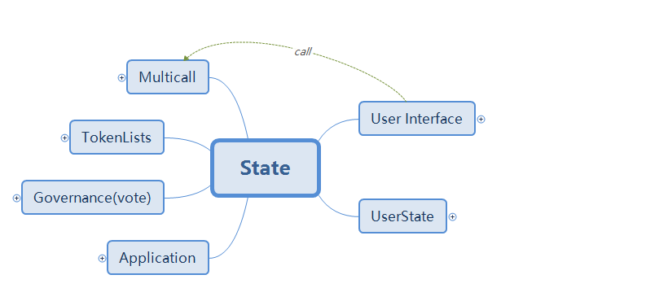

# UniswapV2 Interface Guide

> Interface 是 User Interface 的含义，此为Uniswap网站的代码，包括token交易,添加和移除流动性等功能。 
> 代码分析使用版本 `tag 3.2.7` 

## 技术栈

主要使用的技术栈

- 搭建框架 `React`,  `React-dom`, `React-router-dom`
- 状态管理 `react-redux`, `@reduxjs/toolkit`, 
- Web3 `ethers`,  `typechain`, `@web3-react`
- Uniswap相关依赖 `sdk-core`, `v2-core`, `v2-periphery`, `token-list`, `liquidity-staker` ...
- 缓存管理 `workbox`
- UI 样式、动效、组件、图标、字体、数据展示、语言国际化、交互事件、色彩、文档等
- 工具类

了解详细的技术栈图示请戳这里 :point_right:[Interface 技术栈详细图示](./xmind/Stacks.png)

## 需要提前了解的知识点

- [React Hooks](https://zh-hans.reactjs.org/docs/hooks-intro.html)
- [Reduxjs Toolkit (Redux的官方工具集)](https://redux-toolkit.js.org/introduction/getting-started)
- [TypeScript](https://www.typescriptlang.org/docs/handbook/intro.html)
- [@web3-react](https://github.com/NoahZinsmeister/web3-react)
- [Ethers.js-v5](https://docs.ethers.io/v5/)

## 内容导航

### State数据的结构

从状态管理(State)的角度来看，主要分为六个部分：

- UserSate 用户的钱包数据，使用习惯，自定义token和自定义交易对等信息
- User Interface 用户的交互界面状态，主要是 swap 和 添加/删除流动性 的操作产生的数据变化
- Multicall 使用链上的Multicall合约进行批量请求的模块，其具备以下特点：
    - 针对请求的三个要素(合约地址/调用方法/调用参数)进行归档并建立追踪机制
        - 请求失败自动重连
        - 监听相关状态的改变(如区块高度，chainid变化)，及时取消无用的请求，及时更新过期的数据
    - 批量化请求
        - 将不同请求合并为一个个批次同时发送，节省gas费用
        - 保证每个请求批次不会超过最大gas限制
    - 这也是相对复杂的一个模块
- TokenList 从其他服务器获取交易用的token列表，用户可自定义获取的节点，如 Gemini Token List
- Govemance 社区治理模块
- Application 存储当前区块高度，弹窗数据

了解详细的状态数据结构图请戳这里 :point_right: [状态数据的结构-详细](./xmind/State.png)

#### Multicall State 解析

- Multicall Contract
- State 结构
- Reducer 初始值和规定触发state事件的方法
- Updater 更新state的具体逻辑
- Hooks 页面中实际使用Multicall模块的钩子函数

详细解析请戳这里 :point_right: [Multicall模块解析](./Multicall.md)

### 用户使用流程及State的变化

追踪交互动作与状态数据变化的关系，可以帮助我们更好的理解程序运行的逻辑

- 添加自定义的token流程
- Swap交易流程
- WatchingTransaction 发送交易,及监听和更新的流程
- Approve Token流程
- PoolList 索引用户池子的流程
- AddLiquidity 添加流动性的流程(add/mint)
- RemoveLiquidity 移除流动性的流程

详细解析请戳这里 :point_right: [V2的用户交互流程及状态变化](./UsageAndStates.md)

### 代码解析

- Swap
- Transaction
- PoolList
- AddLiquidity
- RemoveLiquidity

详细解析请戳这里 :point_right: [V2 interface 代码解析](./Code.md)

### 相关辅助数据

请戳这里 :point_right: [辅助数据列表](./InfoList.md)

## 相关引用

- UniswapV2Interface 源码地址：https://github.com/Uniswap/uniswap-interface/tree/v3.2.7
- [催眠大师]手把手教你开发去中心化交易所-Uniswap交易所开发课程：https://www.youtube.com/watch?v=38mVbslZpS4
