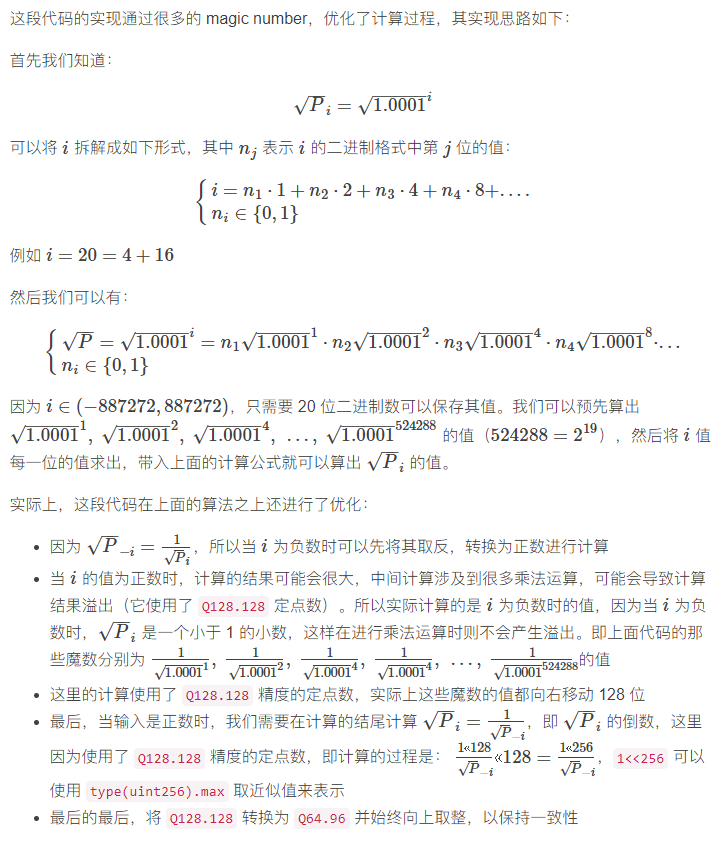

# Tick

UniswapV3将连续的价格范围，分割成有限个离散的价格点。每一个价格对应一个 `tick`，用户在设置流动性的价格区间时，只能选择这些离散的价格点中的某一个作为流动性的边界价格。

- tick组成的价格序列既为一串等比数列，公比为 1.0001 ，下一个价格点为当前价格点的 100.01%。

- 为了计算方便，实际上储存的是√P。而使用时，通常使用tick的序号 `i`。

- tick的序号是固定的整数集合，即 区间 [-887272, 887272] 的整数。原因见下方 [TickMath](#TickMath)

## Tick(library)

tick的数据结构和相关计算方法

### state

### struct

#### Info

```solidity
// info stored for each initialized individual tick
// 每一个初始化之后的 tick 以下列结构储存
struct Info {
    // the total position liquidity that references this tick
    // 该tick上 所有position的流动性累加
    uint128 liquidityGross;
    // amount of net liquidity added (subtracted) when tick is crossed from left to right (right to left),
    // 该tick上 所有position的流动性净值
    int128 liquidityNet;
    // fee growth per unit of liquidity on the _other_ side of this tick (relative to the current tick)
    // 每单位流动性的 手续费数量 outside （相对于当前交易价格的另一边）
    // only has relative meaning, not absolute — the value depends on when the tick is initialized
    // 这只是一个相对的概念，并不是绝对的数值（手续费的计算工具，而并不是实际的手续费）
    // 只有当tick已经初始化后，才会被使用
    uint256 feeGrowthOutside0X128;
    uint256 feeGrowthOutside1X128;
    // the cumulative tick value on the other side of the tick
    // tick 外侧（outside）的 价格 × 时间 累加值
    // 用于 Oracle 的相关计算
    int56 tickCumulativeOutside;
    // the seconds per unit of liquidity on the _other_ side of this tick (relative to the current tick)
    // 每流动性单位的 tick激活时间 (t/L 主要用于计算流动性挖矿的收益) （outside)
    // only has relative meaning, not absolute — the value depends on when the tick is initialized
    // 这只是一个相对的概念，并不是绝对的数值 -- 只有当tick已经初始化后，才会被使用
    uint160 secondsPerLiquidityOutsideX128;
    // the seconds spent on the other side of the tick (relative to the current tick)
    // tick激活时间 （outside）
    // only has relative meaning, not absolute — the value depends on when the tick is initialized
    // 这只是一个相对的概念，并不是绝对的数值 -- 只有当tick已经初始化后，才会被使用
    uint32 secondsOutside;
    // true iff the tick is initialized, i.e. the value is exactly equivalent to the expression liquidityGross != 0
    // tick是否初始化 即 该值完全等同于表达式 liquidityGross != 0 
    // these 8 bits are set to prevent fresh sstores when crossing newly initialized ticks
    // 这个参数的目的是为了防止tick未初始化时，发生更新和存储状态的操作
    bool initialized;
}
```

### functions

#### tickSpacingToMaxLiquidityPerTick

根据tickSpacing计算每个tick上能承载的最大流动性。

为何需要限制最大流动性：

- 因为每个Pool的总流动性 `liquidity` 是 `uint128` 类型，为了防止`liquidity`数据溢出
- 对每个tick承载的流动性做出限制，而不是监控Pool总流动性

```solidity
/// @notice Derives max liquidity per tick from given tick spacing
/// 根据tick spacing 间隔得出每隔tick上所能承载的最大流动性
/// @dev Executed within the pool constructor
/// 该方法由 Pool 构造函数调用
/// @param tickSpacing The amount of required tick separation, realized in multiples of `tickSpacing`
/// tickSpacing tick 的计算间隔
///     e.g., a tickSpacing of 3 requires ticks to be initialized every 3rd tick i.e., ..., -6, -3, 0, 3, 6, ...
///     即 一个值为3的tickspacing 需要每隔3个对tick进行初始化
/// @return The max liquidity per tick
/// 函数返回每个tick能承载的最大流动性
function tickSpacingToMaxLiquidityPerTick(int24 tickSpacing) internal pure returns (uint128) {
    // 计算正数区间和负数区间 各由多少tick需要被初始化
    // 由于前后两端的间隔可能小于 tickspacing，最后可能出现舍弃两端tick的情况
    // 因此先整除再乘 得出精确的tick数量
    // 注意 minTick 得出的是负数 TickMath.MIN_TICK = -887272
    int24 minTick = (TickMath.MIN_TICK / tickSpacing) * tickSpacing;
    int24 maxTick = (TickMath.MAX_TICK / tickSpacing) * tickSpacing;
    // （正整数数量 - 负整数数量）/ tickspacing + 1 （i = 0）
    uint24 numTicks = uint24((maxTick - minTick) / tickSpacing) + 1;
    // liquidity 是 unit128 类型 type(uint128).max 即为 liquidity的最大值
    return type(uint128).max / numTicks;
}
```

相关代码

- [TickMath.MIN_TICK](#MIN_TICK)
- [TickMath.MAX_TICK](#MAX_TICK)
- [tickSpacing](./UniswapV3Pool.md#tickSpacing)

#### getFeeGrowthInside

```solidity
/// @notice Retrieves fee growth data
/// 检索手续费数据 返回feeInside
/// @param self The mapping containing all tick information for initialized ticks
/// self 
/// @param tickLower The lower tick boundary of the position
/// @param tickUpper The upper tick boundary of the position
/// @param tickCurrent The current tick
/// @param feeGrowthGlobal0X128 The all-time global fee growth, per unit of liquidity, in token0
/// @param feeGrowthGlobal1X128 The all-time global fee growth, per unit of liquidity, in token1
/// @return feeGrowthInside0X128 The all-time fee growth in token0, per unit of liquidity, inside the position's tick boundaries
/// @return feeGrowthInside1X128 The all-time fee growth in token1, per unit of liquidity, inside the position's tick boundaries
function getFeeGrowthInside(
    mapping(int24 => Tick.Info) storage self,
    int24 tickLower,
    int24 tickUpper,
    int24 tickCurrent,
    uint256 feeGrowthGlobal0X128,
    uint256 feeGrowthGlobal1X128
) internal view returns (uint256 feeGrowthInside0X128, uint256 feeGrowthInside1X128) {
    Info storage lower = self[tickLower];
    Info storage upper = self[tickUpper];

    // calculate fee growth below
    uint256 feeGrowthBelow0X128;
    uint256 feeGrowthBelow1X128;
    if (tickCurrent >= tickLower) {
        feeGrowthBelow0X128 = lower.feeGrowthOutside0X128;
        feeGrowthBelow1X128 = lower.feeGrowthOutside1X128;
    } else {
        feeGrowthBelow0X128 = feeGrowthGlobal0X128 - lower.feeGrowthOutside0X128;
        feeGrowthBelow1X128 = feeGrowthGlobal1X128 - lower.feeGrowthOutside1X128;
    }

    // calculate fee growth above
    uint256 feeGrowthAbove0X128;
    uint256 feeGrowthAbove1X128;
    if (tickCurrent < tickUpper) {
        feeGrowthAbove0X128 = upper.feeGrowthOutside0X128;
        feeGrowthAbove1X128 = upper.feeGrowthOutside1X128;
    } else {
        feeGrowthAbove0X128 = feeGrowthGlobal0X128 - upper.feeGrowthOutside0X128;
        feeGrowthAbove1X128 = feeGrowthGlobal1X128 - upper.feeGrowthOutside1X128;
    }

    feeGrowthInside0X128 = feeGrowthGlobal0X128 - feeGrowthBelow0X128 - feeGrowthAbove0X128;
    feeGrowthInside1X128 = feeGrowthGlobal1X128 - feeGrowthBelow1X128 - feeGrowthAbove1X128;
}
```

#### update

更新tick的状态，返回激活状态是否发生改变

```solidity
/// @notice Updates a tick and returns true if the tick was flipped from initialized to uninitialized, or vice versa
/// 更新一个tick的状态，返回该tick的激活状态是否发生改变
/// @param self The mapping containing all tick information for initialized ticks
/// 包含所有tick的mapping
/// @param tick The tick that will be updated
/// 需要更新的tick
/// @param tickCurrent The current tick
/// Pool当前价格所在的tick
/// @param liquidityDelta A new amount of liquidity to be added (subtracted) when tick is crossed from left to right (right to left)
/// 流动性变化量，当价格穿过该tick时需要增减的流动性数量
/// @param feeGrowthGlobal0X128 The all-time global fee growth, per unit of liquidity, in token0
/// 当前每单位流动性应得的手续费数量
/// Pool的token0总手续费 / 当前流动性数量 （便于计算不同position应得的手续费数量）
/// @param feeGrowthGlobal1X128 The all-time global fee growth, per unit of liquidity, in token1
/// 同上
/// @param secondsPerLiquidityCumulativeX128 The all-time seconds per max(1, liquidity) of the pool
/// tick激活时间 / 流动性总和 的加权平均值
/// @param time The current block timestamp cast to a uint32
/// blocktime
/// @param upper true for updating a position's upper tick, or false for updating a position's lower tick
/// true 为更新tickupper false 为更新ticklower
/// @param maxLiquidity The maximum liquidity allocation for a single tick
// tick所能承载的最大流动性数量
/// @return flipped Whether the tick was flipped from initialized to uninitialized, or vice versa
/// 返回该tick的激活状态是否发生改变
/// 激活 -> 未激活 | 未激活 -> 激活
function update(
    mapping(int24 => Tick.Info) storage self,
    int24 tick,
    int24 tickCurrent,
    int128 liquidityDelta,
    uint256 feeGrowthGlobal0X128,
    uint256 feeGrowthGlobal1X128,
    uint160 secondsPerLiquidityCumulativeX128,
    int56 tickCumulative,
    uint32 time,
    bool upper,
    uint128 maxLiquidity
) internal returns (bool flipped) {
    // 获取需要更新的tick当前数据
    Tick.Info storage info = self[tick];

    // tick更新之前的流动性总量
    uint128 liquidityGrossBefore = info.liquidityGross;
    // tick更新之后的流动性总量
    uint128 liquidityGrossAfter = LiquidityMath.addDelta(liquidityGrossBefore, liquidityDelta);

    // 更新的总量不能超过tick所能承载的最大流动性数量
    require(liquidityGrossAfter <= maxLiquidity, 'LO');

    // 返回当前tick的激活状态是否发生了改变
    // 激活 -> 未激活 | 未激活 -> 激活
    // 根据流动性总量是否为0来判断激活状态 为0未激活
    flipped = (liquidityGrossAfter == 0) != (liquidityGrossBefore == 0);

    // 如果tick之前未激活 需要对tick进行初始化并激活
    if (liquidityGrossBefore == 0) {
        // by convention, we assume that all growth before a tick was initialized happened _below_ the tick
        // 这里规定当价格在tick左侧
        // feeOutside = Pool的总手续费
        // feeOutside为外侧手续费， 外侧手续费 + 内侧 = 总手续费
        // 具体原理请参见博客原文
        if (tick <= tickCurrent) {
            info.feeGrowthOutside0X128 = feeGrowthGlobal0X128;
            info.feeGrowthOutside1X128 = feeGrowthGlobal1X128;
            info.secondsPerLiquidityOutsideX128 = secondsPerLiquidityCumulativeX128;
            info.tickCumulativeOutside = tickCumulative;
            info.secondsOutside = time;
        }
        // 设置激活状态
        info.initialized = true;
    }

    // 更新tick的总流动性
    info.liquidityGross = liquidityGrossAfter;

    // when the lower (upper) tick is crossed left to right (right to left), liquidity must be added (removed)
    // 更新tick的流动性净值 即 当价格穿过该tick时 用于计算的流动性数量
    // 当此tick作为价格上限更新时 流动性净值需要减
    // 当此tick作为价格下限更新时 流动性净值需要加
    info.liquidityNet = upper
        ? int256(info.liquidityNet).sub(liquidityDelta).toInt128()
        : int256(info.liquidityNet).add(liquidityDelta).toInt128();
}
```

相关代码

- [maxLiquidity](#tickSpacingToMaxLiquidityPerTick)

补充

- [Uniswap v3 详解（四）：交易手续费](https://liaoph.com/uniswap-v3-4/)

#### clear

清除tick的数据

```solidity
/// @notice Clears tick data
/// @param self The mapping containing all initialized tick information for initialized ticks
/// @param tick The tick that will be cleared
function clear(mapping(int24 => Tick.Info) storage self, int24 tick) internal {
    delete self[tick];
}
```

#### cross

当价格穿过tick时，需要对tick状态做出改变

```solidity
/// @notice Transitions to next tick as needed by price movement
/// @param self The mapping containing all tick information for initialized ticks
/// @param tick The destination tick of the transition
/// @param feeGrowthGlobal0X128 The all-time global fee growth, per unit of liquidity, in token0
/// @param feeGrowthGlobal1X128 The all-time global fee growth, per unit of liquidity, in token1
/// @param secondsPerLiquidityCumulativeX128 The current seconds per liquidity
/// @param time The current block.timestamp
/// @return liquidityNet The amount of liquidity added (subtracted) when tick is crossed from left to right (right to left)
function cross(
    mapping(int24 => Tick.Info) storage self,
    int24 tick,
    uint256 feeGrowthGlobal0X128,
    uint256 feeGrowthGlobal1X128,
    uint160 secondsPerLiquidityCumulativeX128,
    int56 tickCumulative,
    uint32 time
) internal returns (int128 liquidityNet) {
    Tick.Info storage info = self[tick];
    info.feeGrowthOutside0X128 = feeGrowthGlobal0X128 - info.feeGrowthOutside0X128;
    info.feeGrowthOutside1X128 = feeGrowthGlobal1X128 - info.feeGrowthOutside1X128;
    info.secondsPerLiquidityOutsideX128 = secondsPerLiquidityCumulativeX128 - info.secondsPerLiquidityOutsideX128;
    info.tickCumulativeOutside = tickCumulative - info.tickCumulativeOutside;
    info.secondsOutside = time - info.secondsOutside;
    liquidityNet = info.liquidityNet;
}
```

补充

- [Uniswap v3 详解（二）：创建交易对/提供流动性#tick-管理](https://liaoph.com/uniswap-v3-2/#tick-%E7%AE%A1%E7%90%86)

## TickBitmap

管理tick初始化状态的位图，在Pool内初始化

```solidity
using TickBitmap for mapping(int16 => uint256);
...
/// @inheritdoc IUniswapV3PoolState
mapping(int16 => uint256) public override tickBitmap;
```

- 键(wordPos)为`int16`(有符号)，值(word)为`uint256`(无符号)，即 每256位为一个word
- 使用二进制0和1记录初始化状态，0 未初始化 1 已初始化，参见flipTick

### functions

#### position

传入tick，获取其在bitmap上，位于第几个word(wordPos)的第几位(bitPos)

**注意：** 在同一个`word`内，`bitPos`越大，tick(index) 反而越小。

- 假设 `tick = 3`, 此时 `bitPos = 3 % 256 = 3`
- 而记录tick状态是利用掩码和异或运算(参见[flipTick](#flipTick)函数)
  - `mask = 1 << 3 = 8` 8 的二进制是 1000
  - `self[wordPos] ^= mask` 可以看出这里是对 uint256 的倒数第4位进行操作
- 即 在第`wordPos`个word内，第 `(256 - bitPos)` 位数值代表了tick的状态

```solidity
/// @notice Computes the position in the mapping where the initialized bit for a tick lives
/// @param tick The tick for which to compute the position
/// @return wordPos The key in the mapping containing the word in which the bit is stored
/// @return bitPos The bit position in the word where the flag is stored
function position(int24 tick) private pure returns (int16 wordPos, uint8 bitPos) {
    wordPos = int16(tick >> 8);
    bitPos = uint8(tick % 256);
}
```

#### flipTick

翻转tick初始化状态。

```solidity
/// @notice Flips the initialized state for a given tick from false to true, or vice versa
/// 翻转tick的初始化状态， 未初始化 -> 初始化，反之亦然
/// @param self The mapping in which to flip the tick
/// self代表bitmap
/// @param tick The tick to flip
/// @param tickSpacing The spacing between usable ticks
/// tickSpacing tick的间距
function flipTick(
    mapping(int16 => uint256) storage self,
    int24 tick,
    int24 tickSpacing
) internal {
    // 检查tick是否已经设置间隔
    // 如果余数不为零，说明tick未按照间隔排列
    require(tick % tickSpacing == 0); // ensure that the tick is spaced
    // 获取tick在哪个word的哪一位上
    (int16 wordPos, uint8 bitPos) = position(tick / tickSpacing);
    // 利用掩码和异或运算做状态的翻转
    uint256 mask = 1 << bitPos;
    self[wordPos] ^= mask;
}
```

相关代码

- [tickSpacing](./UniswapV3Pool.md#tickSpacing)
- [tick.position](#position)

#### nextInitializedTickWithinOneWord

传入`starting tick`(可能未初始化), 在其所在的word内寻找最近离`starting tick`最近的已初始化的tick，若没有已初始化的tick，返回word的边界。

入参解释

- `int24 tick` starting tick 搜索的起始tick
- `int24 tickSpacing` 参见 [tickSpacing](./UniswapV3Pool.md#tickSpacing)
- `lte` next tick (返回值) <= starting tick 的bool值
  - true 为寻找价格较小的tick(包括 starting tick 本身)
  - false 为寻找较大价格的tick

函数返回值 (`next`, `initialized`)

- 当word内已有初始化tick，`next` 返回其 tickIndex
- 当word内无初始化tick，`next` 返回word的边界
  - `lte = true` 时，代表价格趋于变小，`next` 返回word **右** 边界对应的 tickIndex
  - `lte = false` 时，代表价格趋于变大，`next` 返回word **左** 边界对应的 tickIndex
- `initialized` 返回`next`的初始化状态(有可能为false)

```solidity
/// @notice Returns the next initialized tick contained in the same word (or adjacent word) as the tick that is either
/// 在同一个word内返回离传入tick最近的已初始化的tick
/// to the left (less than or equal to) or right (greater than) of the given tick
/// @param self The mapping in which to compute the next initialized tick
/// @param tick The starting tick
/// @param tickSpacing The spacing between usable ticks
/// @param lte Whether to search for the next initialized tick to the left (less than or equal to the starting tick)
/// @return next The next initialized or uninitialized tick up to 256 ticks away from the current tick
/// @return initialized Whether the next tick is initialized, as the function only searches within up to 256 ticks
function nextInitializedTickWithinOneWord(
    mapping(int16 => uint256) storage self,
    int24 tick,
    int24 tickSpacing,
    bool lte
) internal view returns (int24 next, bool initialized) {
    // 计算传入position函数的入参
    int24 compressed = tick / tickSpacing;
    // 若tick < 0 , 需要 -1
    // 若tick >= 0, 因为正数轴上第一个wordPos是0，所以不需要+1
    if (tick < 0 && tick % tickSpacing != 0) compressed--; // round towards negative infinity

    // 搜索价格较小的next(next tick <= starting tick)
    if (lte) {
        // 获取wordPos bitPos
        (int16 wordPos, uint8 bitPos) = position(compressed);
        // all the 1s at or to the right of the current bitPos
        // mask 在二进制下是 1...1 (bitPos+1 个 1)
        uint256 mask = (1 << bitPos) - 1 + (1 << bitPos);
        uint256 masked = self[wordPos] & mask;

        // if there are no initialized ticks to the right of or at the current tick, return rightmost in the word
        // 在word内，小于等于 starting tick 的价格是否有已初始化的tick
        initialized = masked != 0;

        // overflow/underflow is possible, but prevented externally by limiting both tickSpacing and tick
        // 上溢或下溢都是有可能的，但这里限制了 tickSpacing 和 tick 防止这种情况发生
        // 当有初始化tick时，查找小于 starting tick 价格最近的已初始化tick
        // 即 查找word内，starting tick右侧距离最近值为1的位
        // 没有初始化时，直接返回word的右边界（tickindex最小）
        next = initialized
            ? (compressed - int24(bitPos - BitMath.mostSignificantBit(masked))) * tickSpacing
            : (compressed - int24(bitPos)) * tickSpacing;
    } else {
        // 搜索价格较大的next(next tick > starting tick) 不包括 starting tick
        // start from the word of the next tick, since the current tick state doesn't matter
        // 直接从 compressed + 1 开始搜索，因为这里搜索的目标范围不包括 starting tick 本身
        (int16 wordPos, uint8 bitPos) = position(compressed + 1);
        // all the 1s at or to the left of the bitPos
        // 获得掩码 111...110...0 形式，共256位，bitPos 个0，前面全是1
        uint256 mask = ~((1 << bitPos) - 1);
        uint256 masked = self[wordPos] & mask;

        // if there are no initialized ticks to the left of the current tick, return leftmost in the word
        // 在word内，大于 starting tick 的价格是否有已初始化的tick
        initialized = masked != 0;

        // overflow/underflow is possible, but prevented externally by limiting both tickSpacing and tick

        // 当有初始化tick时，查找大于 starting tick 价格最近的已初始化tick
        // 即 查找word内，starting tick左侧距离最近值为1的位
        // 没有初始化时，直接返回word的右边界（tickindex最小）
        next = initialized
            ? (compressed + 1 + int24(BitMath.leastSignificantBit(masked) - bitPos)) * tickSpacing
            : (compressed + 1 + int24(type(uint8).max - bitPos)) * tickSpacing;
    }
}
```

- [TickBitMap.position](#position)
- [TickBitMap.mostSignificantBit](#mostSignificantBit)
- [TickBitMap.leastSignificantBit](#leastSignificantBit)

#### mostSignificantBit

传入x，x二进制下从前往后查第一个值为1的是倒数第几位

```solidity
/// @notice Returns the index of the most significant bit of the number,
///     where the least significant bit is at index 0 and the most significant bit is at index 255
/// @dev The function satisfies the property:
///     x >= 2**mostSignificantBit(x) and x < 2**(mostSignificantBit(x)+1)
/// @param x the value for which to compute the most significant bit, must be greater than 0
/// @return r the index of the most significant bit
function mostSignificantBit(uint256 x) internal pure returns (uint8 r) {
    require(x > 0);

    if (x >= 0x100000000000000000000000000000000) { // 2^128
        x >>= 128;
        r += 128;
    }
    if (x >= 0x10000000000000000) { // 2^64
        x >>= 64;
        r += 64;
    }
    if (x >= 0x100000000) { // 2^32
        x >>= 32;
        r += 32;
    }
    if (x >= 0x10000) { // 2^16
        x >>= 16;
        r += 16;
    }
    if (x >= 0x100) { // 2^8
        x >>= 8;
        r += 8;
    }
    if (x >= 0x10) { // 2^4
        x >>= 4;
        r += 4;
    }
    if (x >= 0x4) { // 2^2
        x >>= 2;
        r += 2;
    }
    if (x >= 0x2) r += 1;
}
```

#### leastSignificantBit

传入x，x二进制下从后往前查第一个值为1的是倒数第几位

```solidity
/// @notice Returns the index of the least significant bit of the number,
///     where the least significant bit is at index 0 and the most significant bit is at index 255
/// @dev The function satisfies the property:
///     (x & 2**leastSignificantBit(x)) != 0 and (x & (2**(leastSignificantBit(x)) - 1)) == 0)
/// @param x the value for which to compute the least significant bit, must be greater than 0
/// @return r the index of the least significant bit
function leastSignificantBit(uint256 x) internal pure returns (uint8 r) {
    require(x > 0);

    r = 255;
    if (x & type(uint128).max > 0) {
        r -= 128;
    } else {
        x >>= 128;
    }
    if (x & type(uint64).max > 0) {
        r -= 64;
    } else {
        x >>= 64;
    }
    if (x & type(uint32).max > 0) {
        r -= 32;
    } else {
        x >>= 32;
    }
    if (x & type(uint16).max > 0) {
        r -= 16;
    } else {
        x >>= 16;
    }
    if (x & type(uint8).max > 0) {
        r -= 8;
    } else {
        x >>= 8;
    }
    if (x & 0xf > 0) {
        r -= 4;
    } else {
        x >>= 4;
    }
    if (x & 0x3 > 0) {
        r -= 2;
    } else {
        x >>= 2;
    }
    if (x & 0x1 > 0) r -= 1;
}
```

## TickMath

Tick 的数学计算方法

tick 的序号，用`i`表示。`i = log√1.0001√P` (以√1.0001为底数，√Price的log值)

### state

#### sqrtPriceX96

UniswapV3中的价格（√P）用`sqrtPriceX96`参数表示

- `sqrtPriceX96` (√P) 可以用 `1.0001^i` 表示
- `sqrtPriceX96` 是一个Q64.96的定点数，即 前64位表示整数部分，后96位表示小数部分，总位数160（由于solidity不支持浮点数，用uint160类型记录）
- 价格的取值范围 [2^-128, 2^128]。因为 `sqrtPriceX96` 的整数相当于（uint64），即 √P 取值范围 [2^-64, 2^64]
- 由上可得tick序号`i`的取值范围 [log√1.0001√2^-64, log√1.0001√2^64]。因此tick的序号是在区间 [-887272, 887272] 的整数集合
- -887272, 887272 即为 `MIN_TICK` 和 `MAX_TICK`

#### MIN_TICK

tick序号在负区间的最大个数

```solidity
/// @dev The minimum tick that may be passed to #getSqrtRatioAtTick computed from log base 1.0001 of 2**-128
int24 internal constant MIN_TICK = -887272;
```

#### MAX_TICK

tick序号在正区间的最大个数

```solidity
/// @dev The maximum tick that may be passed to #getSqrtRatioAtTick computed from log base 1.0001 of 2**128
int24 internal constant MAX_TICK = -MIN_TICK;
```

#### MIN_SQRT_RATIO

`getSqrtRatioAtTick` 函数能返回的最小价格

```solidity
/// @dev The minimum value that can be returned from #getSqrtRatioAtTick. Equivalent to getSqrtRatioAtTick(MIN_TICK)
uint160 internal constant MIN_SQRT_RATIO = 4295128739;
```

#### MAX_SQRT_RATIO

`getSqrtRatioAtTick` 函数能返回的最大价格

```solidity
/// @dev The maximum value that can be returned from #getSqrtRatioAtTick. Equivalent to getSqrtRatioAtTick(MAX_TICK)
uint160 internal constant MAX_SQRT_RATIO = 1461446703485210103287273052203988822378723970342;
```

### functions

#### getSqrtRatioAtTick

由tickIndex计算出 √P



```solidity
/// @notice Calculates sqrt(1.0001^tick) * 2^96
/// 计算 sqrt(1.0001^tick) * 2^96 (因为 sqrtPriceX96 是96位定点数)
/// @dev Throws if |tick| > max tick
/// tick 绝对值 不能超过 MAX_TICK
/// @param tick The input tick for the above formula
/// @return sqrtPriceX96 A Fixed point Q64.96 number representing the sqrt of the ratio of the two assets (token1/token0)
/// 函数返回 sqrtPriceX96 是一个 Q64.96 定点数， 表示 √(token1/token0) 
/// at the given tick
function getSqrtRatioAtTick(int24 tick) internal pure returns (uint160 sqrtPriceX96) {
    // 求出 tick 的绝对值
    uint256 absTick = tick < 0 ? uint256(-int256(tick)) : uint256(int256(tick));
    // tick 绝对值 不能超过 MAX_TICK
    require(absTick <= uint256(MAX_TICK), 'T');

    // 这些魔数分别表示 1/sqrt(1.0001)^1, 1/sqrt(1.0001)^2, 1/sqrt(1.0001)^4....
    // tick 可以用 20 位二进制数表示， 下列代码是计算出每一位的数值（从后往前）

    // absTick & 0x1 将 |tick| 和 0x1 按位与 得出第 20 位数值 （0或1）
    // 第20位(末位)如果为0，需要特殊处理，ratio赋值为0x100...0(32个0)
    // 函数最后需要将ratio (Q128.128定点数) 转换为 sqrtPriceX96 (Q64.96)
    // 结果需要右移32位，所以这里有32个0
    uint256 ratio = absTick & 0x1 != 0 ? 0xfffcb933bd6fad37aa2d162d1a594001 : 0x100000000000000000000000000000000;
    // ratio采用连乘的方式来累加指数（tick），当某一位数值是0时，不参与连乘
    // 每一个魔数都是小于1的Q128.128定点数，所以在每次运算完成后，需要将结果右移128位
    if (absTick & 0x2 != 0) ratio = (ratio * 0xfff97272373d413259a46990580e213a) >> 128;
    if (absTick & 0x4 != 0) ratio = (ratio * 0xfff2e50f5f656932ef12357cf3c7fdcc) >> 128;
    if (absTick & 0x8 != 0) ratio = (ratio * 0xffe5caca7e10e4e61c3624eaa0941cd0) >> 128;
    if (absTick & 0x10 != 0) ratio = (ratio * 0xffcb9843d60f6159c9db58835c926644) >> 128;
    if (absTick & 0x20 != 0) ratio = (ratio * 0xff973b41fa98c081472e6896dfb254c0) >> 128;
    if (absTick & 0x40 != 0) ratio = (ratio * 0xff2ea16466c96a3843ec78b326b52861) >> 128;
    if (absTick & 0x80 != 0) ratio = (ratio * 0xfe5dee046a99a2a811c461f1969c3053) >> 128;
    if (absTick & 0x100 != 0) ratio = (ratio * 0xfcbe86c7900a88aedcffc83b479aa3a4) >> 128;
    if (absTick & 0x200 != 0) ratio = (ratio * 0xf987a7253ac413176f2b074cf7815e54) >> 128;
    if (absTick & 0x400 != 0) ratio = (ratio * 0xf3392b0822b70005940c7a398e4b70f3) >> 128;
    if (absTick & 0x800 != 0) ratio = (ratio * 0xe7159475a2c29b7443b29c7fa6e889d9) >> 128;
    if (absTick & 0x1000 != 0) ratio = (ratio * 0xd097f3bdfd2022b8845ad8f792aa5825) >> 128;
    if (absTick & 0x2000 != 0) ratio = (ratio * 0xa9f746462d870fdf8a65dc1f90e061e5) >> 128;
    if (absTick & 0x4000 != 0) ratio = (ratio * 0x70d869a156d2a1b890bb3df62baf32f7) >> 128;
    if (absTick & 0x8000 != 0) ratio = (ratio * 0x31be135f97d08fd981231505542fcfa6) >> 128;
    if (absTick & 0x10000 != 0) ratio = (ratio * 0x9aa508b5b7a84e1c677de54f3e99bc9) >> 128;
    if (absTick & 0x20000 != 0) ratio = (ratio * 0x5d6af8dedb81196699c329225ee604) >> 128;
    if (absTick & 0x40000 != 0) ratio = (ratio * 0x2216e584f5fa1ea926041bedfe98) >> 128;
    if (absTick & 0x80000 != 0) ratio = (ratio * 0x48a170391f7dc42444e8fa2) >> 128;

    if (tick > 0) ratio = type(uint256).max / ratio;

    // this divides by 1<<32 rounding up to go from a Q128.128 to a Q128.96.
    // we then downcast because we know the result always fits within 160 bits due to our tick input constraint
    // we round up in the division so getTickAtSqrtRatio of the output price is always consistent
    sqrtPriceX96 = uint160((ratio >> 32) + (ratio % (1 << 32) == 0 ? 0 : 1));
}
```

补充

- 代码解析原文 [Uniswap v3 详解（二）：创建交易对/提供流动性 #TickIndex -> √P](https://liaoph.com/uniswap-v3-2/#tick-index---sqrt-p)

#### getTickAtSqrtRatio

由tickIndex计算出 √P
