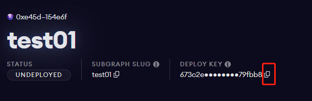
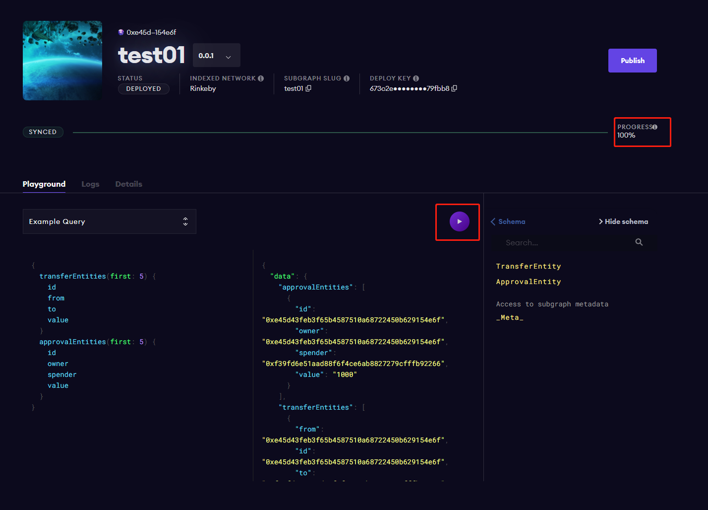
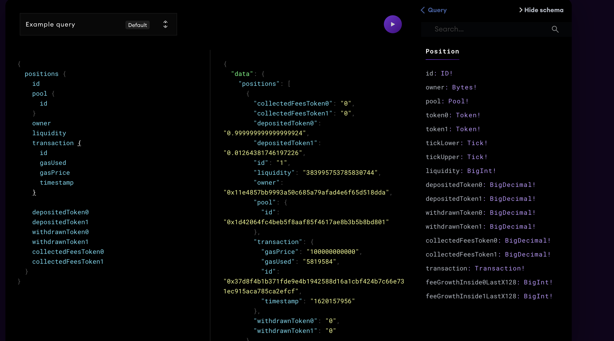

# Graph 实操详解 
## 本地部署  
1.  安装 ganache-cli  
```
# NPM
$ npm install -g truffle ganache-cli

# Yarn
$ yarn global add truffle ganache-cli
``` 

2.  启动 ganache-cli 
这里需要使用 -h 参数进行启动, 保证 
```
ganache-cli -h 0.0.0.0
```

3.  clone graph node 
```
git clone https://github.com/graphprotocol/graph-node/  
```

4.  配置 docker-compose.yml IP 参数  
```
cd graph-node/docker 
./setup.sh 
```

这里需要注意的是, 执行 setup.sh 脚本后, graph-node/docker/docker-compose.yml 中 ethereum 配置的 IP 不一定是正确的, 需要手工再 double check 下, 否则后面 graph-node 连接 ganache-cli 会报错. 具体检查方法如下:   
执行如下命令, 在输出的网卡 IP 中找到内网 IP 地址, （ 如 10.39.204.30 ) , 然后使用这个内网 IP 替换 docker-compose.yml 中的 IP 地址. 或是后面 graph-node 启动后, 进入到 graph-node 容器中, 然后依次 telnet 在 ifconfig 中显示的 IP 地址 ( telnet 对应的端口为 8545, 即 ganache-cli 的端口 ), 看哪个端口联通正常
```
% ifconfig
en0: flags=8863<UP,BROADCAST,SMART,RUNNING,SIMPLEX,MULTICAST> mtu 1500
	options=400<CHANNEL_IO>
	ether 88:66:5a:4a:c6:b9
	inet6 fe80::c21:5190:32d4:7e6a%en0 prefixlen 64 secured scopeid 0x6
	inet 10.39.204.30 netmask 0xffffff00 broadcast 10.39.204.255
	nd6 options=201<PERFORMNUD,DAD>
	media: autoselect
	status: active
```

5.  启动 graph node  
通过上一个步骤, 成功配置 graph node 中 ganache-cli 的连接 IP/端口 后, 就可以执行如下命令启动 graph node 
```
docker-compose up
```

6.  安装 ganache-cli 依然包
```
# NPM
$ npm install -g @graphprotocol/graph-cli

# Yarn
$ yarn global add @graphprotocol/graph-cli
```

7.  初始化 subgraph 
新开命令窗口, 然后到任意一个空目录下, 执行如下命令 
```
graph init --from-example dappLearning/graphtest localgraph 
```

8.  编译 & 部署合约 
```
truffle compile
truffle migrate
```

9.  获取 GravatarRegistry 合约地址 
上述命令 "truffle migrate" 会自动部署 GravatarRegistry 到 ganache, 输入类似如下的信息. 这里我们获取 GravatarRegistry 合约地址 "0x7D1bb47Ca7e571A2443F816074df9c875BB2Ca5E" 以便进行后续操作 
```
2_deploy_contract.js
====================

   Deploying 'GravatarRegistry'
   ----------------------------
   > transaction hash:    0x464f7205d60406530e6860d51c959dba91b0f20f0207971358dedf721e9c440c
   > Blocks: 0            Seconds: 0
   > contract address:    0x7D1bb47Ca7e571A2443F816074df9c875BB2Ca5E
   > block number:        3
   > block timestamp:     1628484437
   > account:             0xA2A07204ABdE98C2F2786f26e9B0F9a7d33b8bdb
   > balance:             99.97009828
   > gas used:            1214144 (0x1286c0)
   > gas price:           20 gwei
   > value sent:          0 ETH
   > total cost:          0.02428288 ETH
```

10. 修改 subgraph.yaml 配置 
使用上一个操作获取到的 GravatarRegistry 合约地址 ( 0x7D1bb47Ca7e571A2443F816074df9c875BB2Ca5E ) 进行如下操作
```
sed -i -e \
    's/0x2E645469f354BB4F5c8a05B3b30A929361cf77eC/0x7D1bb47Ca7e571A2443F816074df9c875BB2Ca5E/g' \
    subgraph.yaml

```

11. 安装依赖 & 生成 graph 代码 
```
yarn && yarn codegen
```

12. 在 graph node 中创建 subgraph 
```
yarn create-local
```

13. 部署 subgraph code 到对应的 subgraph 中 
```
yarn deploy-local
```

14. clone dapp 前端样例代码 
新开终端命令窗口, 然后执行如下命令 
```
git clone https://github.com/graphprotocol/ethdenver-dapp/  
```

15. 配置环境变量 
```
cd ethdenver-dapp
echo 'REACT_APP_GRAPHQL_ENDPOINT=http://localhost:8000/subgraphs/name/dappLearning/graphtest' > .env
```

16. 启动前端 
```
yarn && yarn start
``` 

## 第三方托管 
1.  安装相关依赖

    ```
    yarn install
    ```

2. 配置私钥

    为方便获取，在 .env 中放入的私钥，格式为 "PRIVATE_KEY=xxxx", 然后代码自动从中读取<br>
    另外需要设置你的 infura 节点 id，在 .env 中放入的私钥，格式为 "INFURA_ID=xxxx"

3. 部署合约(用于测试graph的简单合约)

    ```
    npx hardhat run ./scripts/deploy.js --network kovan
    ```

    输出信息类似如下:

    ```
    Deploying contracts with the account: xxxxxxxxxxxxxx
    Account balance: 10000000000000000000000
    Token address: 0x5FbDB2315678afecb367f032d93F642f64180aa3
    Transfer 50 to receiver  0xf39Fd6e51aad88F6F4ce6aB8827279cffFb92266
    Account balance of receiver is:  50
    ```

4. TheGraph 创建一个 Subgraph 空间
    
    因为需要借助 TheGraph 的节点来完成数据的索引，因此我们需要在 [TheGraph Studio](https://thegraph.com/studio/) 上创建一个 Subgraph。

    如果没有 The Graph 的账户，可以直接连接钱包注册，账户名即为钱包地址，以下称之为`<THEGRAPH_USERNAME>`。
    
    批准钱包签名之后，会跳转到 `My Subgraphs` 面板，点击 `Create a Subgraph` 按钮。
    

    输入你的项目名称(例如TEST01)，以下称之为 `<SUBGRAPH_NAME>`，点击 continue 按钮，之后会跳转到subgraph的项目主页


5. 开发和部署 subgraph  
  
    先使用 yarn 在全局安装 Graph CLI

    ```bash
    yarn global add @graphprotocol/graph-cli
    ```

6. 初始化配置:

    ```bash
    graph init --studio <SUBGRAPH_NAME>
    ```

    - 在 "Subgraph name" 和 "Directory to create the subgraph" 直接回车即可
    - Ethereum network 这里选择 kovan
    - "Contract address" 这里输入在步骤 3 中部署合约时生成的合约地址
    - 上面执行到 "fetch ABI from Etherscan" 时会报执行失败，然后出现 "ABI file (path)" 字样，提示输入本机中 abi 的文件路径，这里我们输入 SimpleToken.json 所在的路径即可(`./abis/SimpleToken.json`)
    - 如果yarn install 失败(例如网络错误)，可以进入新生成的项目目录，手动安装npm依赖

    <br>


7. 修改定义模式

    - 两个文件的修改范例在 `./scripts/schema.graphql` 和 `./scripts/mapping.ts`

    - `<SUBGRAPH_NAME>/schema.graphql`  修改文件内容如下

        ```graphql
        type TransferEntity @entity {
          id: ID!
          from: Bytes! # address
          to: Bytes! # address
          value: BigInt! 
        }


        type ApprovalEntity @entity {
          id: ID!
          owner: Bytes! # address
          spender: Bytes! # address
          value: BigInt! 
        }
        ```

    - `<SUBGRAPH_NAME>/src/mapping.ts` 修改文件内容如下

        ```ts
        import { BigInt } from "@graphprotocol/graph-ts"
        import {
          SimpleToken,
          Transfer,
          Approval
        } from "../generated/SimpleToken/SimpleToken"
        import { TransferEntity,ApprovalEntity } from "../generated/schema"

        export function handleTransfer(event: Transfer): void {
          // Entities can be loaded from the store using a string ID; this ID
          // needs to be unique across all entities of the same type
          let entity = TransferEntity.load(event.transaction.from.toHex())

          // Entities only exist after they have been saved to the store;
          // `null` checks allow to create entities on demand
          if (entity == null) {
            entity = new TransferEntity(event.transaction.from.toHex())
            
          }

          // BigInt and BigDecimal math are supported
          entity.value = event.params.value

          // Entity fields can be set based on event parameters
          entity.from = event.params.from
          entity.to = event.params.to

          // Entities can be written to the store with `.save()`
          entity.save()

          // Note: If a handler doesn't require existing field values, it is faster
          // _not_ to load the entity from the store. Instead, create it fresh with
          // `new Entity(...)`, set the fields that should be updated and save the
          // entity back to the store. Fields that were not set or unset remain
          // unchanged, allowing for partial updates to be applied.

          // It is also possible to access smart contracts from mappings. For
          // example, the contract that has emitted the event can be connected to
          // with:
          //
          // let contract = Contract.bind(event.address)
          //
          // The following functions can then be called on this contract to access
          // state variables and other data:
          //
          // - contract.approve(...)
          // - contract.totalSupply(...)
          // - contract.transferFrom(...)
          // - contract.increaseAllowance(...)
          // - contract.balanceOf(...)
          // - contract.decreaseAllowance(...)
          // - contract.transfer(...)
          // - contract.allowance(...)
        }

        export function handleApproval(event: Approval): void {
          // Entities can be loaded from the store using a string ID; this ID
          // needs to be unique across all entities of the same type
          let entity = ApprovalEntity.load(event.transaction.from.toHex())

          // Entities only exist after they have been saved to the store;
          // `null` checks allow to create entities on demand
          if (entity == null) {
            entity = new ApprovalEntity(event.transaction.from.toHex())
            
          }

          // BigInt and BigDecimal math are supported
          entity.value = event.params.value

          // Entity fields can be set based on event parameters
          entity.owner = event.params.owner
          entity.spender = event.params.spender

          // Entities can be written to the store with `.save()`
          entity.save()
        }

        ```

8. 修改实体名字

    - 进入 graphtest 目录
    - 修改 subgraph.yaml 中 entities 定义如下

    ```yaml
    ...
    entities:
      - TransferEntity
      - ApprovalEntity
    ...
    ```

9. 授权和部署 Subgraph

    首先获取你的`<DEPLOY KEY>`，在你的subgraph项目主页可以找到：
    

    - 授权

      ```bash
      graph auth --studio <DEPLOY KEY>
      ```

    - 进入subgraph的本地目录

      ```bash
      cd ./<SUBGRAPH_NAME>
      ```
    
    - BUILD SUBGRAPH

      ```bash
      graph codegen && graph build
      ```

    - DEPLOY SUBGRAPH

      ```bash
      graph deploy --studio <SUBGRAPH_NAME>
      ```

      - 这里必须输入 `Version Label` , 比如`0.0.1`， 否则会报错提示 `You must provide a version label.`


### 检验subgraph是否部署成功

从subgraphs面板进入你的subgraph项目主页， 查看索引进度，当进度100%可以开始调用。

这里已经预生成了一个示例请求，点击播放按钮即可请求数据。至此subgraph部署成功



### subgraph

subgraph 定义了你希望通过 GraphQL API 提供的数据、数据源和数据访问模式。开发者可以选择直接使用别人已经部署[17]的 subgraph，或者自己定义并部署 subgraph。

1. GraphQL Schema  
   GraphQL Schema 定义了你想保存和查询的数据类型/实体。也可定义如关系或全文搜索的配置项。
2. subgraph 清单（ yaml 配置）  
   manifest 定义了 subgraph 索引的智能合约、合约的 ABI、关注这些合约的事件，以及如何将事件数据映射到 Graph 节点存储并允许查询。
3. AssemblyScript 映射  
   AssemblyScript 映射允许您使用 schema 中定义的实体类型保存要索引的数据。Graph CLI 还使用 schema 与智能合约的 ABI 的组合生成 AssemblyScript 类型。
4. 通过@derivedFrom 建立关系  
   通过@derivedFrom 字段在实体上定义反向查询，这样就在实体上创建了一个虚拟字段，使它可以被查询，但不能通过映射 API 手动设置。实际上，这是从另一个实体上定义的关系中衍生出来的。这样的关系，对存储关系的两者意义不大，如果只存储一方而派生另一方，则索引和查询性能都会更好。 


## subgrap 配置文件解析  
1. subgraph.yaml  
```yaml 
## 指示当前使用的 graph 解析 API 所使用的版本
specVersion: 0.0.2  

## 描述此 subgraph 的作用目的  ( 可选项 )
description: Gravatar for Ethereum   

## 一个链接指向, 指示此 subgraph 存放的仓库地址 ( 可选项 )
repository: https://github.com/graphprotocol/example-subgraph  

## 此 subgraph 的模式定义 
schema:  
  ## 模式定义文件路径  
  file: ./schema.graphql  

## 数据源定义 
dataSources:
  ## 描述数据源的数据类型，这里表示数据源是以太坊的合约
  - kind: ethereum/contract
    ## 数据源的名字 
    name: Gravity
    ## 数据源所在的区块链网络，这里 mainnet 表示的是主网 
    network: mainnet
    ## 数据源在区块链网络上的具体相关信息
    source:
      ## 数据源所在的合约地址
      address: '0x2E645469f354BB4F5c8a05B3b30A929361cf77eC'
      ## 合约对应的 abi 名字，具体对应到下面 mapping/abis 中的 name 所指示的 ABI 名字 
      abi: Gravity
      ## 进行索引的起始区块
      startBlock: 1000
    ## 数据源字段映射
    mapping:
      ## 目前为固定值，这里只能填写 ethereum/events
      kind: ethereum/events
      ## 解析映射所使用的 API 版本 
      apiVersion: 0.0.4 
      ## Mapping API 解析映射时所使用的语言，当前可填写的值只有 wasm/assemblyscript. 
      language: wasm/assemblyscript
      ## 实体定义
      entities:
        ## 实体的名字，需要和 schema.graphql 中的名字对应
        - Gravatar
      ##  contract 对应的 ABI 文件信息
      abis:
        ## contract 名字
        - name: Gravity
          ## contract 对应的 abi 文件路径
          file: ./abis/Gravity.json
      ## 合于事件对应的处理映射信息
      eventHandlers:
        ## event 的名字
        - event: NewGravatar(uint256,address,string,string)
          ## event 对应在 mapping.ts 文件中的处理函数
          handler: handleNewGravatar
        - event: UpdatedGravatar(uint256,address,string,string)
          handler: handleUpdatedGravatar
      ## mapping.ts 文件存放路径
      file: ./src/mapping.ts
``` 


2. schema.graphql   
实体定义的文件, 使用 GraphQL 接口定义语言, 具体参考网上相关文档   
```graphql
type Gravatar @entity {
  id: ID!
  owner: Bytes!
  displayName: String!
  imageUrl: String!
}
```

3. mapping.ts    
定义如何转换区块数据到实体数据   
```ts
import { NewGravatar, UpdatedGravatar } from '../generated/Gravity/Gravity'
import { Gravatar } from '../generated/schema'

export function handleNewGravatar(event: NewGravatar): void {
  let gravatar = new Gravatar(event.params.id.toHex())
  gravatar.owner = event.params.owner
  gravatar.displayName = event.params.displayName
  gravatar.imageUrl = event.params.imageUrl
  gravatar.save()
}

export function handleUpdatedGravatar(event: UpdatedGravatar): void {
  let id = event.params.id.toHex()
  let gravatar = Gravatar.load(id)
  if (gravatar == null) {
    gravatar = new Gravatar(id)
  }
  gravatar.owner = event.params.owner
  gravatar.displayName = event.params.displayName
  gravatar.imageUrl = event.params.imageUrl
  gravatar.save()
}

```

## 在 mapping.ts 中处理合约,区块等相关数据    
### ethereum API    
可以用来和以太坊合约, events 事件, 区块, 交易 进行交互, 获取相应的数据  
Event 代码定义如下 ( 可以在 vscode 中查看具体的 Event 及各字段的定义信息  )
```ts
  // 定义 event 
  class Event {
    // 发出此 event 的合约地址
    address: Address
    // 此事件在 logs 中的 index 索引 
    logIndex: BigInt
    transactionLogIndex: BigInt
    logType: string | null
    // 发出此事件对应的区块
    block: Block
    // 发出此事件对应的交易 
    transaction: Transaction
    // 事件触发时传入的各个参数值  
    parameters: Array<EventParam>
  }
```

- 获取 event 数据   
以 "event NewGravatar(uint id, address owner, string displayName, string imageUrl)" 为例
    - 获取 evnet 中的 owner 参数值  
      event.params.owner   
    - 获取 evnet 中的 displayName 参数值  
      event.params.owner  

- 访问合约状态变量  
```ts      
// 根据发出事件的合约地址, 构造合约   
let contract = ERC20Contract.bind(event.address)
// 使用函数访问的形式， 访问合约的公共状态变量 ( symbol )
let erc20Symbol = contract.symbol() 

// 访问 mapping 类型的状态变量
// 举例: mapping(address => mapping(address => mapping(uint24 => address))) public override getPool;
contract.getPool(address1, address2, address3) 
```    

- 实体交互     
```ts
// 创建实体  
let id = event.params.id.toHex()
let gravatar = new Gravatar(id)

// 保存实体 
gravatar.save() 

// 加载实体  
gravatar = Gravatar.load(id)

// 删除实体 
store.remove('Gravatar', id)
```

- 交易信息访问  
```ts
// 获取发生此 event 事件的 交易 hash
let id = event.transaction.hash.toHex()
```

- 区块访问  
```ts
// 获取区块的 hash 值
let blockHash =  event.block.hash.toHexString()
```

- 其他 API 交互 
```ts
// 日志打印
log.debug('Block number: {}, block hash: {}, transaction hash: {}', [
    event.block.number.toString(), // "47596000"
    event.block.hash.toHexString(), // "0x..."
    event.transaction.hash.toHexString(), // "0x..."
  ])

// IPFS 数据读取
let hash = 'QmTkzDwWqPbnAh5YiV5VwcTLnGdwSNsNTn2aDxdXBFca7D'
let data = ipfs.cat(hash)
```

- uniswap v3 subgraph 
github 上已经有实现的 uniswap v3 subgraph, 可以参考这个 subgraph 实现来定制自己需要的 subgraph      
https://github.com/Uniswap/uniswap-v3-subgraph  


## 通过 TheGraph 查询   
以 uniswap v3 为例, 登陆如下网址, 即可查看 uniswap v3 相关数据   
https://thegraph.com/legacy-explorer/subgraph/uniswap/uniswap-v3     

- 普通查询  
输入如下查询 graphql 查询语句, 点击查询,
```graphql
{
  positions {
    id
    pool {
      id
    }
    owner
    liquidity
    transaction {
      id
      gasUsed
      gasPrice
      timestamp
    }

    depositedToken0
    depositedToken1
    withdrawnToken0
    withdrawnToken1
    collectedFeesToken0
    collectedFeesToken1
  }
}
```
  

- 条件查询  
The Graph 提供了条件过滤查询功能, 可以在查询时输入过滤条件. 具体支持的过滤条件可以查看官网说明   
https://thegraph.com/docs/developer/graphql-api  
   

- 注意事项  
使用 The Graph 进行查询时, 有一点需要注意的是, 查询语句是区分单复数的. 如下的查询语句中, "pools" 这个单词用的是复数形式, 如果使用单数的 "pool" 进行查询的话则会报错. 同理, 对于实体中的子实体, 同样要注意单复数之分. 
```
{
  pools{
    id
    burns{
      id
      origin
      timestamp
      owner
      amount0
      amount1
      amountUSD
      tickLower
    }
  }
}
```

## Node.js 中查询 graph 数据     
在 Dapp 或是 Node.js 脚本中, 也经常需要查询 graph 数据. 在 scripts 目录中给出了一个样例的 node 脚本, 从 The Graph 中获取数据. 因为还没有实践过在 Dapp 中集成 graph, 所以这里暂不提供 Dapp 的 graph 样例代码.  
需要注意的是, 使用 graph API 从 The Graph 获取数据时, 默认是返回 100 条数据, 即使数据总量超过 100 条, 达到 1W 条. 因此在样例代码中, 使用 "first:1000" 强制 The Graph 返回 1000 条数据.   
```ts
const query_position = gql`query($_pool_id: String, $_timestamp_gt: Int){
  pools(where : {id : $_pool_id } ) {
    id
    mints( where: {timestamp_gt : $_timestamp_gt } , first:1000 , orderBy: timestamp){
      id
      timestamp
      owner
      origin
      amount
      amount0
      amount1
      amountUSD
      tickLower
      tickUpper
      transaction {
        id
        gasUsed
        gasPrice
      }
    }
  }
}`;
```

## 参考链接   
https://github.com/graphprotocol/graph-node/blob/master/docs/subgraph-manifest.md  
https://learnblockchain.cn/article/2632  