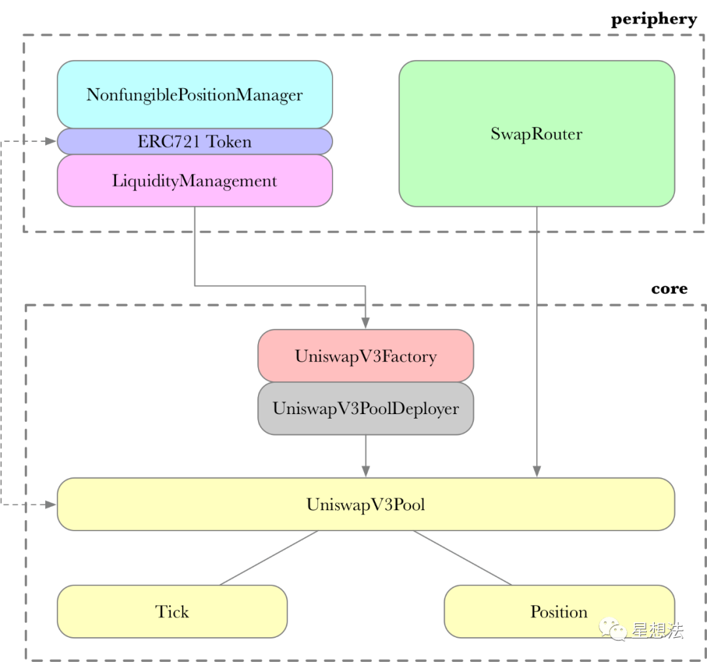

# Uniswap V3

作为 DeFi 的核心项目之一, Uniswap V3 是所有 Defi 开发者必备的研究项目.
Uniswap V3 研究小组总结输入了 Uniswap V3 的白皮书分析, 代码逻辑, 前端展示效果等, 并把研究成果分享到 BiliBili 上, 以供后续开发者研究学习.

分享会回放视频：

- Uniswap V3——白皮书解读: https://www.bilibili.com/video/BV1go4y1X7Kx/
- Uniswap V3——合约代码解析 (1): https://www.bilibili.com/video/BV1gL411n7LZ/
- Uniswap V3——合约代码解析 (2): https://www.bilibili.com/video/BV1zM4y1N7JW/
- Uniswap V3——前端代码解析-part1: https://www.bilibili.com/video/BV1KQ4y1m7md/
- Uniswap V3——前端代码解析-part2: https://www.bilibili.com/video/BV1gb4y1U7S4/

## Whitepaper

- 白皮书地址
- 科普文
  - 如何理解 V3 白皮书
  - 预言机使用算术平均和几何平均的两种机制对比实验

详细内容请戳这里 :point_right: [白皮书导读](./whitepaperGuid/readme.md)

## Contract

Uniswap v3 在代码层面的架构和 v2 基本保持一致，将合约分成了两个仓库：

- uniswap-v3-core
  - UniswapV3Factory 是交易池(UniswapV3Pool)统一创建的接口。
  - UniswapV3Pool 由 UniswapV3PoolDeployer 统一部署。 实现代币交易，流动性管理，交易手续费的收取，oracle 数据管理。接口的实现粒度比较低，不适合普通用户使用，错误的调用其中的接口可能会造成经济上的损失。
    UniswapV3Pool 是核心逻辑，管理了 Tick 和 Position，实现流动性管理以及一个交易池中 swap 功能实现。
- uniswap-v3-periphery
  - NonfungiblePositionManager 负责交易池的创建以及流动性的添加删除，用来增加/移除/修改 Pool 的流动性，并且通过 NFT token 将流动性代币化。使用 ERC721 token（v2 使用的是 ERC20）的原因是同一个池的多个流动性并不能等价替换（v3 的集中流性动功能）。
  - SwapRouter 是 swap 路由的管理。提供代币交易的接口，它是对 UniswapV3Pool 合约中交易相关接口的进一步封装，前端界面主要与这个合约来进行对接。

### 代码解析

主要代码解析：

- [NonfungiblePositionManager](./contractGuid/NonfungiblePositionManager.md)
- [SwapRouter](./contractGuid/SwapRouter.md)
- [UniswapV3Factory](./contractGuid/UniswapV3Factory.md)
- [UniswapV3Pool](./contractGuid/UniswapV3Pool.md)
- [Tick](./contractGuid/Tick.md)
- [Oracle](./contractGuid/Oracle.md)

### 用户交互流程

#### NonfungiblePositionManager

- CreatePool 创交易对池子
- mint 铸造代表流动性的 ERC721 代币返回给用户
- increaseLiquidity 添加流动性
- decreaseLiquidity 移除流动性
- collect 收取手续费
- burn 销毁流动性 token

#### SwapRouter

- exactInput 指定精确输入的交易
- exactOutput 指定精确输出的交易
- flash swap 闪电贷交易

详细内容请戳这里 :point_right: [UniswapV3 合约导读](./contractGuid/readme.md)

## SDK

详细内容请戳这里 :point_right: [SDK 导读](./frontGuid/sdk/README.md)

## Graph

Graph 实操详解

- 本地部署
- 第三方托管
- 在 mapping.ts 中处理合约,区块等相关数据
- 通过 TheGraph 查询
- Node.js 中查询 graph 数据

详细内容请戳这里 :point_right: [Graph 导读](./graphGuid/graphGuid.md)

## Interface

Interface 是 User Interface 的含义，此为 Uniswap 网站的代码，包括 token 交易,添加和移除流动性等功能。

- 代码分析使用版本 `tag 4.12.8`
- UniswapV2Interface 源码地址：https://github.com/Uniswap/uniswap-interface/tree/v4.12.8
- **文档侧重解析 V3 与 V2 不同的部分**，建议先查看[V2 版本的讲解](../Uniswap-V2/Interface/readme.md)

内容目录:

- 使用的技术栈
- 需要提前了解的知识点
- State 数据的结构
- Multicall State 解析
- 用户使用流程及 State 的变化
- 代码解析
- 相关辅助数据
- 相关引用

详细内容请戳这里 :point_right: [UniswapV3 Interface Guid](./InterfaceGuid/readme.md)

## 参考链接

- uniswap - V3 技术白皮书导读: https://learnblockchain.cn/article/2357
- 如何在合约中集成 Uniswap v3: https://learnblockchain.cn/article/2580
- Uniswap v3 详解（一）：设计原理: https://liaoph.com/uniswap-v3-1/
- Uniswap v3 特性解析: https://medium.com/taipei-ethereum-meetup/uniswap-v3-features-explained-in-depth-178cfe45f223
- Awesome-Uniswap v3 项目: https://github.com/GammaStrategies/awesome-uniswap-v3
- uniswap - V3 源代码导读: https://mp.weixin.qq.com/s/SYjT3HH48V7WaSGmkPOzKg
- nft farming: https://github.com/spore-engineering/nft-required-liquidity-mining-pool/blob/main/LiquidityFarmingNFT.sol
- 一键部署 V3: https://github.com/omarish/uniswap-v3-deploy-plugin
- 自动调用合约: https://www.gelato.network/
- Uniswap V3 LP 无常损失保险协议: https://www.chainnews.com/articles/715772476688.htm
- 流动性策略: https://arxiv.org/pdf/2106.12033.pdf
- 流动性提供: https://mellowprotocol.medium.com/uniswap-v3-liquidity-providing-101-f1db3822f16d
- 做市策略： https://zhuanlan.zhihu.com/p/390751130
