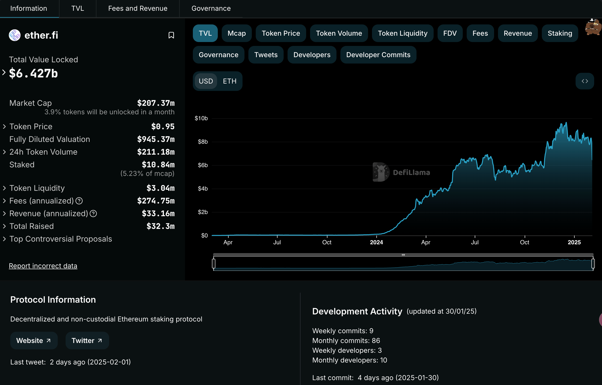

## 1. 项目概述

**Ether.fi** 是一个建立在以太坊生态上的去中心化金融（DeFi）协议，其目标是为用户提供高效、简单且安全的资产管理与收益优化工具。项目致力于整合多种 DeFi 原语，通过模块化设计和跨协议整合，帮助用户实现收益优化、资产增值和风险管理，同时兼顾去中心化与安全性。

## 2. 背景与愿景

- **背景动机**  
  在 DeFi 生态中，用户面对各类协议（如借贷、流动性挖矿、收益聚合器等）时，往往需要在多个平台之间切换，并应对不同的操作复杂性和安全风险。Ether.fi 希望通过一站式平台整合这些功能，使用户能够在一个统一界面下进行资产管理和收益优化，从而降低操作门槛和管理成本。

- **愿景目标**  
  - **简化操作流程**：为用户提供直观易用的界面，降低 DeFi 操作复杂度。  
  - **收益优化**：通过智能合约和数据驱动的策略，帮助用户自动化寻找最优收益方案。  
  - **安全透明**：依托于公开透明的区块链技术和严格的安全审计机制，确保用户资金安全。  
  - **生态互联**：构建开放的 DeFi 生态平台，支持跨协议、跨应用的资产互操作性和组合创新。

## 3. 核心技术架构

Ether.fi 在技术实现上采用了模块化、可组合的架构设计，主要体现在以下几个方面：

### 3.1 模块化智能合约架构

- **资产管理模块**  
  用户存入的资产会由智能合约进行管理，支持资产托管、拆分、计息及清算等功能。模块化设计使得后续功能扩展（如引入新的收益产品）可以在不影响整体系统稳定性的前提下平滑升级。

- **收益优化与自动化策略模块**  
  该模块利用链上数据和外部预言机（Oracle）获取市场信息，通过算法模型对各类收益产品进行比较，自动为用户配置最优资产组合。系统支持动态调整参数，应对市场波动，降低因预测误差带来的风险。

- **跨协议整合与互操作模块**  
  Ether.fi 通过开放 API 与主流 DeFi 协议（如 Uniswap、Aave、Compound 等）对接，实现资产之间的跨平台流动与互操作。这样一来，用户可以在一个平台内实现借贷、兑换、收益挖矿等多种操作，无需在多个应用之间频繁切换。

### 3.2 数据驱动与安全机制

- **数据采集与预言机支持**  
  为确保收益计算和风险控制的准确性，Ether.fi 集成了多个数据源和预言机服务，实现市场数据的实时采集和动态更新。这样能让系统依据最新数据进行收益预估和风险评估。

- **安全审计与多重防护**  
  为了保护用户资金安全，核心智能合约通常会经过第三方安全机构的严格审计，并配备多重安全防护机制（如权限控制、限额策略、异常行为检测等）。所有操作均在链上记录，保证数据公开透明，便于追踪和验证。

## 4. 关键功能与产品特性

Ether.fi 提供了一系列面向终端用户和开发者的功能，其核心产品和特性主要包括：

### 4.1 一站式资产管理与收益聚合

- **统一资产仪表盘**  
  用户可在 Ether.fi 平台查看各类链上资产的实时余额、收益情况和风险指标，并通过直观的图表分析资产组合表现。
  
- **自动化收益策略**  
  系统内置多种收益策略，用户可以选择“自动配置”模式，由平台根据实时市场数据自动调仓和再投资，以获取最优年化收益。

### 4.2 跨协议与跨链互操作

- **跨协议接入**  
  平台支持与主流 DeFi 协议互联，用户可以通过 Ether.fi 发起借贷、交换、流动性挖矿等操作，整合多协议优势。
  
- **跨链资产管理**  
  随着跨链技术的发展，Ether.fi 计划扩展对其他公链（如 Polygon、Binance Smart Chain 等）的支持，实现不同链之间的资产无缝互换和管理。

### 4.3 用户体验与便捷性

- **直观易用的界面**  
  设计上注重用户体验，提供简单易懂的操作流程和实时反馈，使得即便是初级用户也能快速上手。
  
- **移动与桌面兼容**  
  Ether.fi 采用响应式设计，支持移动端和桌面端多平台访问，方便用户随时监控和管理资产。

### 4.4 社区治理与激励机制

- **DAO 治理**  
  为增强平台透明度和社区参与度，Ether.fi 计划推出去中心化自治组织（DAO），让代币持有者共同参与协议升级、收益分配和风险管理等重大决策。
  
- **激励奖励**  
  除了基本的资产增值，平台还设计了激励机制，通过代币奖励和手续费分红鼓励用户参与平台治理、流动性提供和生态推广。

## 5. 代币经济模型

虽然具体细节可能随着项目发展不断调整，但 Ether.fi 通常会设计与以下几个方面相关的代币经济机制：

- **治理代币**  
  平台发行治理代币，赋予持有者投票权和决策参与权，用于平台治理和生态资金分配。  
- **激励奖励**  
  用户参与平台交易、提供流动性或参与治理时，可获得一定比例的代币奖励，从而促进平台生态活跃度。  
- **手续费分成**  
  部分手续费收入可能按比例返还给代币持有者或流动性提供者，形成长期激励机制。

## 6. 生态合作与未来展望

### 6.1 生态整合与合作

Ether.fi 致力于构建开放的 DeFi 生态，未来将进一步拓展与其他区块链项目、DeFi 协议、跨链桥和数据服务提供商的合作，形成互利共赢的生态网络。

### 6.2 技术演进与产品迭代

- **产品功能扩展**  
  随着用户需求不断增加，未来 Ether.fi 有望推出更多高级功能，如智能资产组合管理、风险对冲工具和定制化收益策略等。
  
- **跨链支持与全球化布局**  
  随着跨链技术的发展，平台将不断扩展对其他主流公链的支持，实现全球化资产管理和流动性整合。

- **DAO 治理完善**  
  通过不断完善去中心化治理机制，逐步将平台的决策权下放给社区，让生态发展更加民主和透明。

## 总结

Ether.fi 作为一个创新型 DeFi 平台，借助模块化智能合约架构、数据驱动的收益优化策略和跨协议整合能力，致力于为用户提供一站式的资产管理与收益增值解决方案。其核心优势在于：
- **收益自动化与优化**：通过智能策略自动为用户配置最优收益方案；
- **跨协议和跨链互操作**：整合多种 DeFi 原语，简化用户操作；
- **安全透明**：依托链上公开记录和严格审计机制，确保资金安全；
- **社区治理与激励**：引入 DAO 模式，增强生态活力和用户参与度。

随着 DeFi 生态的不断成熟和跨链技术的推广，Ether.fi 有望在未来成为用户实现高效资产管理和收益优化的重要工具，为整个金融生态带来更多创新机会。

