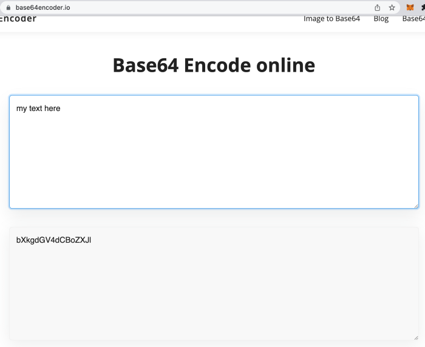
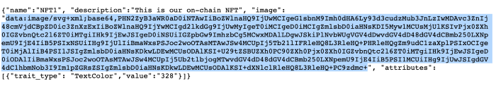
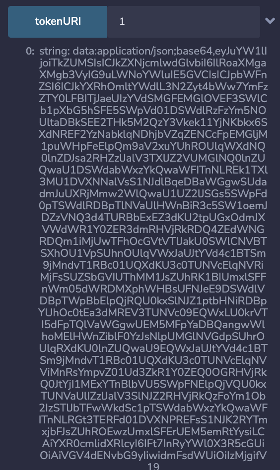
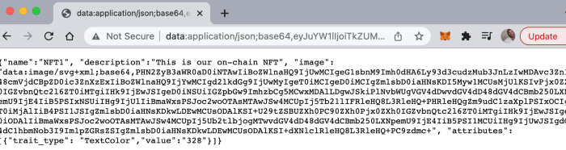
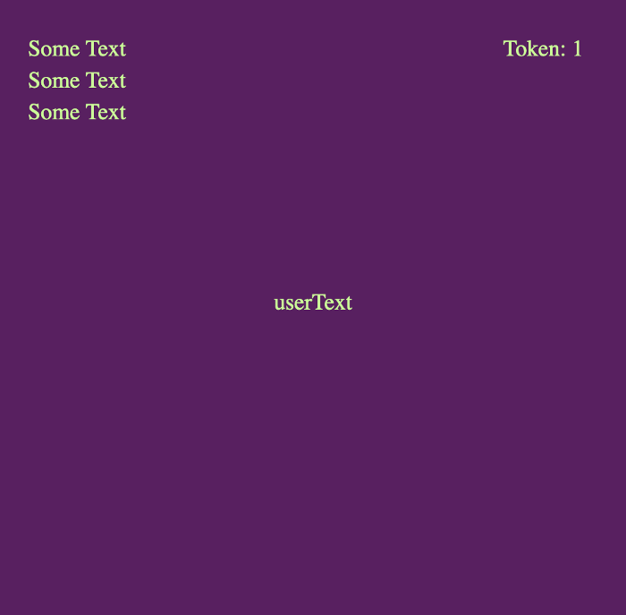
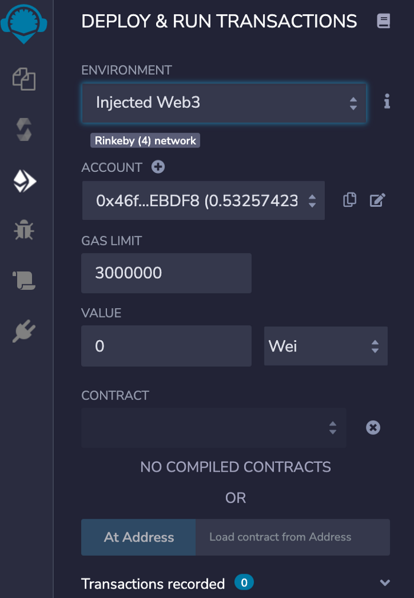

# Loot NFT

## [EmojiLootWithStory合约分析](./EmojiLootWithStory合约分析.md)

## Reference link

1. https://medium.com/coinmonks/how-to-create-on-chain-nfts-with-solidity-1e20ff9dd87e
2. https://github.com/Park-City-Utah/onChainNFT
3. https://www.youtube.com/watch?v=UBGXFV1TQxc
4. https://www.youtube.com/channel/UC1LV4_VQGBJHTJjEWUmy8nA

## How To Create On-chain NFTs with Solidity
Incorporating user content into an NFT at mint

Having been some time since I’ve written anything blockchain or NFT related I figured an update was in order.

At the time of writing this my first NFT article, Creating Generative Art NFTs with Python and Solidity, has over 50k views; many of which resulted individuals, companies and dev teams reaching out for blockchain development or consultation services. Thanks to readers sharing these articles I’ve had the opportunity to work on a number of interesting projects — today I’d like to share the details of one such project in particular. The client request in this case, to develop an entirely on-chain NFT with the additional capability of adding user content at time of mint.
### Off-chain NFTs
This begs the question, aren’t all NFTs on-chain? Well, anyone who has worked on an NFT project on the Ethereum blockchain can tell you there are real limitations with regard to on-chain data storage; this is prohibitively expensive and most NFT projects store both image and metadata files off-chain. Typically the only data we see stored “on-chain” is an immutable hash to our metadata (our tokenURI) — The easiest way to describe this hash is a link to our actual NFT, the difference here being that a hash is dependant on the data from which it is created; alter the source, and the hash is no longer valid, hence it is immutable. To keep things ‘decentralized’ off chain storage solutions like IPFS and Arweve do the ‘heavy lifting’ with respect to decentralized NFT data storage by leveraging a ‘community’ of nodes around the world — anyone can run an IPFS node just as anyone can run a blockchain miner or consensus node.

Now, you may be familiar with ‘on-chain’ projects like Loot, so how is this done? Can we actually store proper visual media on-chain?

Well the answer is yes but it requires a few things, namely Base64 encoding and the SVG image type. Both allow us to deal in textual data rather than the typical memory ‘heavy’ visual data like PNG or JPEG. This means we need to do 2 things:

1 — Base64 encode our json metatdata

2 — Encode ‘instructions’ for image render in the SVG format

Lucky for us browsers can understand both formats and browser based marketplaces like OpenSea can render our NFT in the same way it would a link to an IPFS storage hash however, instead of ‘getting & caching’ the image, the browser renders the image for us.

As usual the code to achieve this can be found and forked here; Remix will be the easiest way to test your code**.

### Base64 encoding
One way to we can achieve on-chain metadata storage and avoid the requirement for any tool such as IPFS is to base64 encode it and store it directly in our NFT token data. You may be familiar with the TokenURI function that returns to us, and OpenSea, the hash to our metadata.. well in our case tokenURI will return the actual metadata, in an encoded format; this is no longer a ‘link’ but the metadata itself.

As I said we will be leveraging an existing Base64.sol library from GitHub, you can find that repo here. You can import from github or simply clone/copy the code and import this file from the same directory you pasted this in.

A note on encoding in Base64, encoding is not a form of data compression therefor we are not reducing the size of our data we are simply storing it in a format that our browser can decode. Our metadata is NOT prohibitively large, which is the case of our NFT image. You can see an example of this below:



In our example code we leverage the function ‘BuildMetaData’ which takes a tokenId (the id of our NFT) and returns a base64 encoded json text string with everything OpenSea needs to render our NFT with its Name, Description, Attributres, and very importantly, our Image. It also leverages the BuildImage function that I will explain below.

The following is a sample of our metadata:
```
{
  "name":"NFT1", 
  "description":"This is our on-chain NFT", 
  "image": "data:image/svg+xml;base64,PHN2ZyB3aWR0aD0iNTAwIiBoZWlnaHQ9IjUwMCIgeG1sbnM9Imh0dHA6Ly93d3cudzMub3JnLzIwMDAvc3ZnIj48cmVjdCBpZD0ic3ZnXzExIiBoZWlnaHQ9IjYwMCIgd2lkdGg9IjUwMyIgeT0iMCIgeD0iMCIgZmlsbD0iaHNsKDI5Myw1MCUsMjUlKSIvPjx0ZXh0IGZvbnQtc2l6ZT0iMTgiIHk9IjEwJSIgeD0iNSUiIGZpbGw9ImhzbCg5MCwxMDAlLDgwJSkiPlNvbWUgVGV4dDwvdGV4dD48dGV4dCBmb250LXNpemU9IjE4IiB5PSIxNSUiIHg9IjUlIiBmaWxsPSJoc2woOTAsMTAwJSw4MCUpIj5Tb21lIFRleHQ8L3RleHQ+PHRleHQgZm9udC1zaXplPSIxOCIgeT0iMjAlIiB4PSI1JSIgZmlsbD0iaHNsKDkwLDEwMCUsODAlKSI+U29tZSBUZXh0PC90ZXh0Pjx0ZXh0IGZvbnQtc2l6ZT0iMTgiIHk9IjEwJSIgeD0iODAlIiBmaWxsPSJoc2woOTAsMTAwJSw4MCUpIj5Ub2tlbjogMTwvdGV4dD48dGV4dCBmb250LXNpemU9IjE4IiB5PSI1MCUiIHg9IjUwJSIgdGV4dC1hbmNob3I9Im1pZGRsZSIgZmlsbD0iaHNsKDkwLDEwMCUsODAlKSI+dXNlclRleHQ8L3RleHQ+PC9zdmc+", 
  "attributes": [
    {
      "trait_type": "TextColor",
      "value":"328"
    }
  ]
}
```

Typically our ‘image’ value would look something like this:

```
{
"image": "ipfs://QmWwMDLz6hQKCqjYba5cSHdrNUvPvAdndtaWjdFpm52GYm/1.gif"
}
```

So whats up with our Image value? This looks like it is also Base64 encoded… Well, you are right our Image value is 1 — SVG and 2 — the SVG is also Base64 encoded; this means our SVG text has been encoded just like our json (text) data.

You will notice that we append something to our encoded json and it looks like this:

> “data:application/json;base64,”

This simply describes what the data is, and therefore how the recipient, or recipients browser can DECODE it accordingly.
### ABI Encoding
You likely noticed that we also perform ABI encoding throughout our project code. ABI encoding or Application Binary Interface in our case will simply allows us to concatenate multiple lines of text. “This”, “is”, “my”, “code” will cause errors if it is not encoded into a single string.
### SVG files
So what is SVG and why does it matter to us? [SVG or scalable vector graphics](https://www.w3schools.com/graphics/svg_intro.asp) essentially allows us to store images in a xml type format, or as text; text that can be stored on-chain. Rather than store large image data, we describe our intend image in text and encode this in a way our browser, and OpenSea, can render for us. We can set all kinds of features of our image including size, color and even text that can be rendered for us.

Think about it this way, if I want to send you a simple image I can either email or text you a high resolution PNG, or you could simply describe it in a few words and let your recipient render or generate it for you. If date or the transmission of data is expensive we can make a ‘trade off’ by reducing that cost via increasing the cost, as effort, by the recipient.

The following text description is likely much less data intensive to relay, then a high def PNG. As long as the recipient has the tools to easily render this we have just dramatically reduced the cost in terms of data storage or transmission:

> “500x500 size blue background with white text saying ‘Hello World’”

Our sample code describes the parameters for our SVG in the function BuildImage.
There are many great online tools and templates for SVG generation, I encourage you to find some tooling that helps make your idea a SVG reality.

One thing I will advise is to make sure you use percentages for layout, as with app development ‘hard coding’ values can cause us problems when we increase or reduce the size of of the screen on which we render. 1000 pixels for a starting point of our text may be fine, until we reduce the screen size of our device below 1000x1000, in this case we would be better suites to have set this to 80%.

Our SVG, before ABI and Base64 encoding:

```
'<svg width="500" height="500" xmlns="http://www.w3.org/2000/svg">',
'<rect id="svg_11" height="600" width="503" y="0" x="0" fill="hsl(',
currentWord.bgHue,
',50%,25%)"/>',
'<text font-size="18" y="10%" x="5%" fill="hsl(',
random,
',100%,80%)">Some Text</text>',
'<text font-size="18" y="15%" x="5%" fill="hsl(',
random,
',100%,80%)">Some Text</text>',
'<text font-size="18" y="20%" x="5%" fill="hsl(',
random,
',100%,80%)">Some Text</text>',
'<text font-size="18" y="10%" x="80%" fill="hsl(',
random,
',100%,80%)">Token: ',
_tokenId.toString(),
"</text>",
'<text font-size="18" y="50%" x="50%" text-anchor="middle" fill="hsl(',
random,
',100%,80%)">',
currentWord.value,
"</text>",
"</svg>"
```

The output of our SVG BuildImage can be seen here:



You will once again notice that we have appended details with regard to the data:
> “data:image/svg+xml;base64”

### User Input
One of the more interesting features of our smart contract is the ability for user to contribute to the final NFT by inputing some text data into the mint function. This user input is saved as a ‘memory string’ and later added to our SVG data dynamically via the BuildImage function.

I have limited the size of the text input and added an error for this restriction but otherwise the user has full range on what they might add. This is immutable and will live on the blockchain forever— this may cause some to want to restrict certain words but in accordance with the democratized nature of the blockchain technology, I have placed no further limitations or censorship.

Our mint function achieves this feature simply by adding a string expectation on the function:
```
function mint(string memory _userText) public payable {
    uint256 supply = totalSupply();
    bytes memory strBytes = bytes(_userText);
    require(strBytes.length <= stringLimit, "String input exceeds limit.");
    require(exists(_userText) != true, "String already exists!");
    
    Word memory newWord = Word(
        string(
            abi.encodePacked(
                "NFT",
                uint256(supply + 1).toString()
            )
        ),
        "This is our on-chain NFT",
        randomNum(361, block.difficulty, supply).toString(),
        randomNum(361, block.timestamp, supply).toString(),
        _userText
    );

    if (msg.sender != owner()) {
        require(msg.value >= 0.005 ether);
    }

    wordsToTokenId[supply + 1] = newWord; //Add word to mapping @tokenId
    _safeMint(msg.sender, supply + 1);
}
```
### Interacting with our NFT & Smart Contract
If you are using a tool such as Remix you can simply alter the code provided, upload this to Remix, compile and deploy to test.

Being that our mint function expect user input string data, you will be able to add text and then leverage our tokenURI function to see what is produced, this is the same tokenURI function that marketplaces like OpenSea will leverage to retrieve OR resolve our NFT data and image.



So what do we do with this? To render this in your browser you will want to copy everything AFTER ‘string’ (we don’t need this) and paste this in our browser. The result of pasting this into our browser will look like this:




Further, we can see our image by copying the “image” value, the part we want to copy is highlighted here:


And the result can be seen here:


### Our NFT
With that, we have created a smart contract that will allow users to enter text at the time of mint, generate SVG data that includes our user input, encode this into Base64, and add this into our metadata that is also base64 encoded. The result, an on-chain NFT that will render in marketplaces like OpenSea as such:



### **A note on Remix
If you choose to test your code on Remix you may find you run into a timeout error when you attempt to run tokenURI — this is due to the limitations of the online JVM and can be solved by simply switching your ‘Environment’ setting to ‘Injected web3’. I personally use the Rinkeby test net with my Metamask browser wallet. You will need Rinkeby testnet Eth for gas from a Rinkeby faucet.



Rinkeby is a great way to test and successful mint will actually mean you can view your NFTs on the [Rinkeby OpenSea instance](https://rinkeby.opensea.io/) , essentially a clone of OpenSea.
Happy testing!
### Video
For an extremely detailed walkthrough of very similar code, although without user input functionality at the mint, please check out the following [youtube video](https://www.youtube.com/watch?v=UBGXFV1TQxc) and follow [Hashlips’ Channel](https://www.youtube.com/channel/UC1LV4_VQGBJHTJjEWUmy8nA) where you will find all kinds of excellent NFT content.