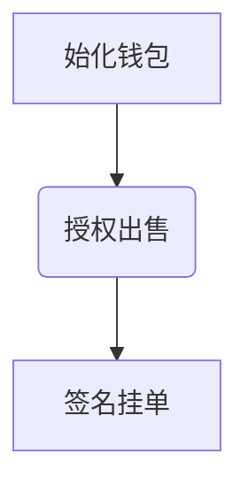
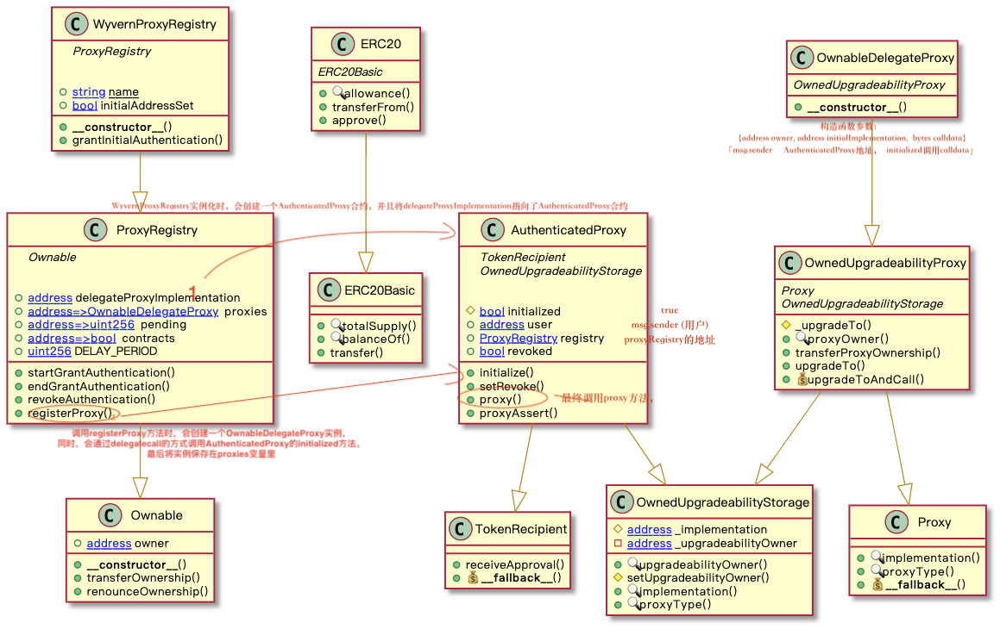
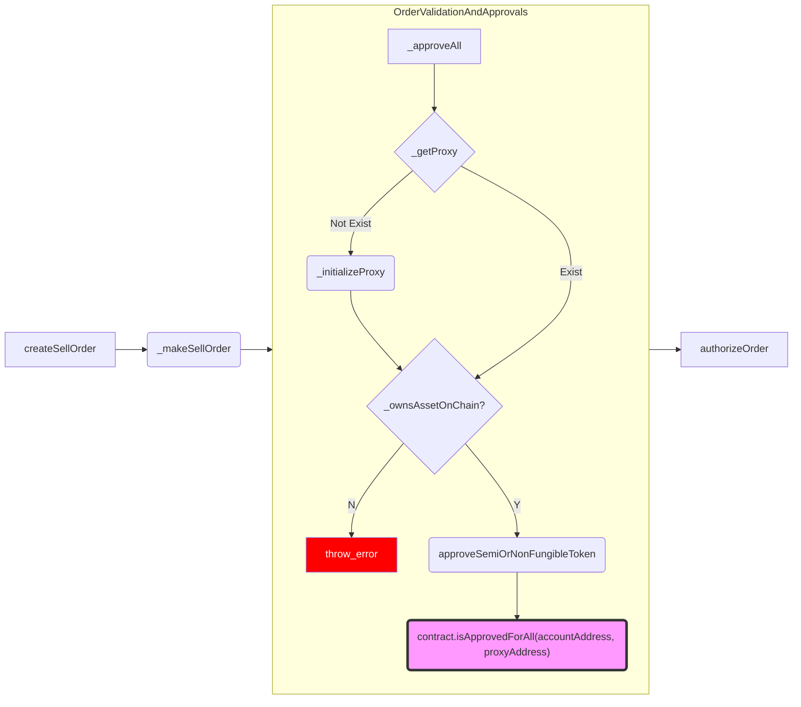
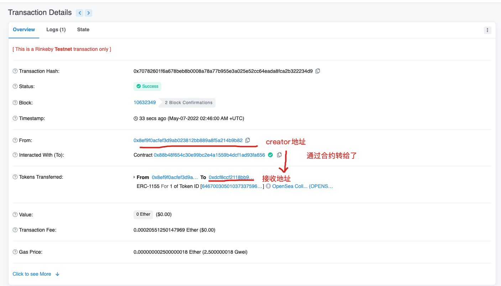

# Opensea流程解读

## 前言

> 以下文档是基于opensea上一个版本的流程来进行分析的，上一个版本opensea的交易还主要是对[WyvernProtocol ](https://github.com/wyvernprotocol/wyvern-v3)协议进行改造后，然后实现的。
>
> 当前版本opensea使用了新的协议：seaport，这个协议流程还没有进行研究。


## 授权流程

在 opensea 上出售 nft 时，需要经过三个步骤：



### 1.初始化钱包

如果是第一次出售 nft，需要初始化钱包。

初始化钱包实际上帮我们创建了一个 proxy 合约，它调用了 WyverProxyRegistry 合约上的 registerProxy 方法。


关于这个WyverProxyRegistry 合约，它的继承关系如下图。




- 我们的钱包调用了ProxyRegistry合约的registerProxy 方法后，首先会创建一个OwnableDelegateProxy合约的instance;

- 同时，OwnableDelegateProxy的构造函数里，会通过`delegatecall`，最后调到AuthenticatedProxy合约的`initialize`方法；

  

- AuthenticatedProxy的initialize里初始化了『`initialized`，`user` ，`registry`』三个变量。

  *registry这个状态变量就是WyverProxyRegistry 合约的地址；这样做是为了以后能够很容易通过`proxy.registry`来找到WyverProxyRegistry*；

  

- 最后将proxy实例维护在`proxies`这个mapping里；返回proxy；


### 2.授权出售NFT

在opensea上出售NFT，是需要授权的，这样opensea最后才有权限去transfer你的出售的token；

授权这个动作，实际上是调用了`ERC721.setApprovalForAll(address to, bool approved)`方法；

to就是第一步创建的proxy合约实例的地址；

也就是允许刚刚opensea帮我们创建的 proxy 合约，去 transfer 我们钱包上的某一个 erc721 的资产；

举个例子（图片在参考资料里找到的，不是我的）：

这个授权就是调用CryptoApes的合约的setApprovalForAll方法；


总结一下上面2个步骤的流程：


## 创建出售订单

创建订单，需要用到签名；签名的协议也是用的eip-271的signTypedData;

实际上，这一步，我们可以调用opensea-sdk来实现；下文会讲到；

先来看看opensea的订单的参数结构：

>关于签名，实际上最后调用的是 eth_signTypedData_v4；
>
>```js
>return e.currentProvider.sendAsync(
>  {
>    method: 'eth_signTypedData_v4',
>    params: [n, JSON.stringify(t)],
>    from: n,
>    id: new Date().getTime(),
>  },
>  r
>);
>
>```
>

订单结构如下：

```json
{
  "types": {
    "EIP712Domain": [
      {
        "name": "name",
        "type": "string"
      },
      {
        "name": "version",
        "type": "string"
      },
      {
        "name": "chainId",
        "type": "uint256"
      },
      {
        "name": "verifyingContract",
        "type": "address"
      }
    ],
    "Order": [
      {
        "name": "exchange",
        "type": "address"
      },
      {
        "name": "maker",
        "type": "address"
      },
      {
        "name": "taker",
        "type": "address"
      },
      {
        "name": "makerRelayerFee",
        "type": "uint256"
      },
      {
        "name": "takerRelayerFee",
        "type": "uint256"
      },
      {
        "name": "makerProtocolFee",
        "type": "uint256"
      },
      {
        "name": "takerProtocolFee",
        "type": "uint256"
      },
      {
        "name": "feeRecipient",
        "type": "address"
      },
      {
        "name": "feeMethod",
        "type": "uint8"
      },
      {
        "name": "side",
        "type": "uint8"
      },
      {
        "name": "saleKind",
        "type": "uint8"
      },
      {
        "name": "target",
        "type": "address"
      },
      {
        "name": "howToCall",
        "type": "uint8"
      },
      {
        "name": "calldata",
        "type": "bytes"
      },
      {
        "name": "replacementPattern",
        "type": "bytes"
      },
      {
        "name": "staticTarget",
        "type": "address"
      },
      {
        "name": "staticExtradata",
        "type": "bytes"
      },
      {
        "name": "paymentToken",
        "type": "address"
      },
      {
        "name": "basePrice",
        "type": "uint256"
      },
      {
        "name": "extra",
        "type": "uint256"
      },
      {
        "name": "listingTime",
        "type": "uint256"
      },
      {
        "name": "expirationTime",
        "type": "uint256"
      },
      {
        "name": "salt",
        "type": "uint256"
      },
      {
        "name": "nonce",
        "type": "uint256"
      }
    ]
  },
  "domain": {
    "name": "Wyvern Exchange Contract",
    "version": "2.3",
    "chainId": 4,
    "verifyingContract": "0xdd54d660178b28f6033a953b0e55073cfa7e3744" //opensea WyvernExchangeWithBulkCancellations contract
  },
  "primaryType": "Order",
  "message": {
    "maker": "0xdcf8ccf2118bb980996bacd56764851b63de324e", // 订单发起者
    "exchange": "0xdd54d660178b28f6033a953b0e55073cfa7e3744", // exchange合约地址
    "taker": "0x0000000000000000000000000000000000000000", // 订单的对手方
    "makerRelayerFee": "250",
    "takerRelayerFee": "0",
    "makerProtocolFee": "0",
    "takerProtocolFee": "0",
    "feeRecipient": "0x5b3256965e7c3cf26e11fcaf296dfc8807c01073",
    "feeMethod": 1,
    "side": 1,
    "saleKind": 0,
    "target": "0x45b594792a5cdc008d0de1c1d69faa3d16b3ddc1", // MerkleValidator
    "howToCall": 1, // CALL || DELEGATE
    "calldata": "0xfb16a595000000000000000000000000dcf8ccf2118bb980996bacd56764851b63de324e000000000000000000000000000000000000000000000000000000000000000000000000000000000000000023a9d04ce000a8e680fc64c5bf98d183051f8e940000000000000000000000000000000000000000000000000000000000000002000000000000000000000000000000000000000000000000000000000000000000000000000000000000000000000000000000000000000000000000000000c00000000000000000000000000000000000000000000000000000000000000000",
    "replacementPattern": "0x000000000000000000000000000000000000000000000000000000000000000000000000ffffffffffffffffffffffffffffffffffffffffffffffffffffffffffffffff00000000000000000000000000000000000000000000000000000000000000000000000000000000000000000000000000000000000000000000000000000000000000000000000000000000000000000000000000000000000000000000000000000000000000000000000000000000000000000000000000000000000000000000000000000000000000000000000000000000000000000000000000000000",
    "staticTarget": "0x0000000000000000000000000000000000000000",
    "staticExtradata": "0x",
    "paymentToken": "0x0000000000000000000000000000000000000000", // 付款币种，eth用0
    "basePrice": "1000000000000000",
    "extra": "0",
    "listingTime": "1652431596",
    "expirationTime": "1652517974",
    "salt": "47075773979792799614927834020790905564917082318969569266948652682981084022844",
    "nonce": 0
  }
}
```


怎么通过前端代码来生成这些 calldata、salt 等等数据呢？

使用 opensea-js 这 sdk 来帮助我们生成，

我们创建一个OpenSeaPort的client，

然后直接调用\_makeSellOrder 方法，就可以简单的创建一个sell order了；

```
 const tokenAddress = "0xc70be5b7c19529ef642d16c10dfe91c58b5c3bf0";
    const tokenId = 4367;
    const quantity = 1;
    const decimals = 2;
    const client = new OpenSeaPort(network.provider);
    const order = await client._makeSellOrder({
      asset: {
        tokenAddress, tokenId,
        decimals,
        schemaName: WyvernSchemaName.ERC1155,
      },
      accountAddress: walletAddress,
      startAmount: 3,
      quantity,
      buyerAddress: NULL_ADDRESS,
      paymentTokenAddress: NULL_ADDRESS,
    });
    console.log(order);
```


在sdk里，创建订单的流程如下：




## 买家吃单流程

买家创建订单的流程其实和卖家创建出售订单的流程基本类似；

### 授权

买家不需要创建proxy合约，只需要授权opensea的合约，允许transfer一定比例的weth即可；


### 创建订单

通过sdk来成交订单

```js
const createBidOrder = async () => {
    const quantity = 1;

    const price = 0.02;

  const walletAddress = '';
  
    const order = await sdkClient.createBuyOrder({
      asset,
      quantity,
      accountAddress: walletAddress,
      startAmount: price, // value of offer;
      expirationTime: getMaxOrderExpirationTimestamp(), // 具体参考demo源码
      paymentTokenAddress: "0xc778417e063141139fce010982780140aa0cd5ab",
      waitForHighestBid: false,
      buyerAddress: NULL_ADDRESS,
      extraBountyBasisPoints: 0, // 百分比的提成
    });

    setBidOrder(order);
  }
```


### 关于吃单成交

opensea上拍卖成交的模式有2种，

- 一种是卖家出售后，买家直接一口价，按卖家的报价成交了；
- 一种是买家对商品给一个自己的价格，然后卖家来选择某一个报价进行成交；

我们以买家吃单的模式来分解下opensea-sdk里做了什么事情：


# Opensea 上碰到的几个问题：

## **1.opensea 上创建一个 nft，需要 gas 吗？这个 nft 是 mint 过的吗？**

回答：我测试了整个流程。无论是创建 collection 还是创建 nft，都是没有任何手续费的，应该是纯中心化的。

nft 创建后，返回了一个地址

```
https://testnets.opensea.io/assets/0x88b48f654c30e99bc2e4a1559b4dcf1ad93fa656/64670030501037337596962501089550358285943868856449738089342406679359102386177
```

这个地址包含了两个信息：

- `0x88b48f654c30e99bc2e4a1559b4dcf1ad93fa656`是合约地址，对应着一个 opensea collection 合约。
- `64670030501037337596962501089550358285943868856449738089342406679359102386177`是我创建的 nft 的 tokenId。

这个 nft 的活动日志显示：nft 被 minted 到我的地址上了，实际上这些都是 opensea 自己中心化的操作。


 只有当我 transfer 这个 nft 的时候，才会真正的去 mint，并且支付 gas。


然后看这笔交易信息：




## **2、opensea 在取消订单时，为什么要支付 gas？**


在 atomicMath 的方法里，有一个 requireValidOrder 的内部方法，会去校验订单以及签名是否合法。它的内部会调用 validateOrder 方法。

```
   function requireValidOrder(Order memory order, Sig memory sig)
        internal
        view
        returns (bytes32)
    {
        bytes32 hash = hashToSign(order);
        require(validateOrder(hash, order, sig));
        return hash;
    }
```


validateOrder 方法里会通过 cancelledOrFinalized 这个 map 来判断订单是否已经取消了。

这个状态的修改是需要上链的。

为什么需要上链呢？ 因为不上链的话，这笔 offer 所对应的 sign 是一直有效的，所以如果不取消订单，这个卖单信息，别人是可以通过 API 来查询的，任何人都可以拿到这个卖单信息，然后创建一个买单去进行成交。那么可能你的 nft 就会被卖出。


## **3、opensea 上为什么用 weth 是不用支付 gas 的？？**

如果你是卖家，在你报价的时候，opensea 会有一系列流程。上面有讲到过。

初始化钱包的时候，以及调用 setApproveForAll 方法，这二步都是需要 gas 费的。

不过是这些 gas 一次付费，终身享用的。下次再卖就不用付了。

如果你只是一个买家，在用 weth 去 transfer 的时候，opensea 会要求你 approve 合约 transfer 你的 weth。一般会比你需要支付的大很多。这是为了防止下次再 approve。


## **4、既然商家的 nft 没有 mint，那么是什么时候进行 mint 的呢，以及如何 mint 的？**

**首先**，我们可以看到。opensea 上有一个叫 OpenStore 的智能合约，是 opensea 自己的 nft。

> 主网：https://etherscan.io/address/0x495f947276749ce646f68ac8c248420045cb7b5e#code
>
> 测试网：https://rinkeby.etherscan.io/address/0x88b48f654c30e99bc2e4a1559b4dcf1ad93fa656#events

所有的 nft 都是在这个合约上 mint 的。 具体我们在 opensea 的网站是 add item，会返回一个地址：

`https://testnets.opensea.io/assets/0x88b48f654c30e99bc2e4a1559b4dcf1ad93fa656/64670030501037337596962501089550358285943868856449738089342406677160079130625`

可以看到`0x88b48f654c30e99bc2e4a1559b4dcf1ad93fa656`这个合约地址能对应的上，后面是 tokenId。

**然后**，我们看下订单撮合时，做了什么事情？

opensea 最终成交时，会调用 exchange 合约上**atomicMatch**方法完成交易。atomicMatch 做了以下几件事情：

- 首先校验订单参数；
- 接着，通过 sell.maker，来找到 seller 的 proxy 合约地址;
- 调用 AuthenticatedProxy 合约的 `proxy方法`
- proxy 方法指向
- 最后由`target合约`进行 token 的转移

```solidity
/**
     * @dev Atomically match two orders, ensuring validity of the match, and execute all associated state transitions. Protected against reentrancy by a contract-global lock.
     * @param buy Buy-side order
     * @param buySig Buy-side order signature
     * @param sell Sell-side order
     * @param sellSig Sell-side order signature
     */
    function atomicMatch(Order memory buy, Sig memory buySig, Order memory sell, Sig memory sellSig, bytes32 metadata)
        internal
        reentrancyGuard
    {

        bytes32 buyHash;
        if (buy.maker == msg.sender) {
            require(validateOrderParameters(buy));
        } else {
            buyHash = requireValidOrder(buy, buySig);
        }

        // Ensure sell order validity and calculate hash if necessary.
        bytes32 sellHash;
        if (sell.maker == msg.sender) {
            require(validateOrderParameters(sell));
        } else {
            sellHash = requireValidOrder(sell, sellSig);
        }

        // Must be matchable. */
        require(ordersCanMatch(buy, sell));

        // Target must exist (prevent malicious selfdestructs just prior to order settlement). */
        uint size;
        address target = sell.target;
        assembly {
            size := extcodesize(target)
        }
        require(size > 0);

        // Must match calldata after replacement, if specified. */
        if (buy.replacementPattern.length > 0) {
          ArrayUtils.guardedArrayReplace(buy.calldata, sell.calldata, buy.replacementPattern);
        }
        if (sell.replacementPattern.length > 0) {
          ArrayUtils.guardedArrayReplace(sell.calldata, buy.calldata, sell.replacementPattern);
        }
        require(ArrayUtils.arrayEq(buy.calldata, sell.calldata));

        // Retrieve delegateProxy contract. */
        // 取到delegateProxy合约地址
        OwnableDelegateProxy delegateProxy = registry.proxies(sell.maker);

        // Proxy must exist. */
        require(delegateProxy != address(0));

        // Assert implementation. */
        require(delegateProxy.implementation() == registry.delegateProxyImplementation());

        // Access the passthrough AuthenticatedProxy. */
        // 生成一个AuthenticatedProxy合约实例
        AuthenticatedProxy proxy = AuthenticatedProxy(delegateProxy);

        // EFFECTS */

        // Mark previously signed or approved orders as finalized. */
        if (msg.sender != buy.maker) {
            cancelledOrFinalized[buyHash] = true;
        }
        if (msg.sender != sell.maker) {
            cancelledOrFinalized[sellHash] = true;
        }

        // INTERACTIONS */

        // Execute funds transfer and pay fees. */
        uint price = executeFundsTransfer(buy, sell);

        // Execute specified call through proxy. */
        require(proxy.proxy(sell.target, sell.howToCall, sell.calldata));

        // Static calls are intentionally done after the effectful call so they can check resulting state. */

        // Handle buy-side static call if specified. */
        if (buy.staticTarget != address(0)) {
            require(staticCall(buy.staticTarget, sell.calldata, buy.staticExtradata));
        }

        // Handle sell-side static call if specified. */
        if (sell.staticTarget != address(0)) {
            require(staticCall(sell.staticTarget, sell.calldata, sell.staticExtradata));
        }

        // Log match event. */
        emit OrdersMatched(buyHash, sellHash, sell.feeRecipient != address(0) ? sell.maker : buy.maker, sell.feeRecipient != address(0) ? buy.maker : sell.maker, price, metadata);
    }
```


# 附：

### Opensea 在 Rinkeby 网络上的合约地址

https://rinkeby.etherscan.io/address/{address}#readContract

```
WyvernTokenTransferProxy合约：0xcdc9188485316bf6fa416d02b4f680227c50b89e

WyvernProxyRegistry合约： 0x1e525eeaf261ca41b809884cbde9dd9e1619573a 这个合约应该是部署了多个，我看到很多地址上都有交易。// todo 需要确认是不是opensea做了分布式？

AuthenticatedProxy合约地址： 0xa3632d715577d6bc46632e9bdb647dd695dd0566

Exchange合约地址：0xdD54D660178B28f6033a953b0E55073cFA7e3744

Token合约地址：0xedab78408441027a98071668b6dcc8962a0f0312 这个应该是Wyvern协议里带的，实际上没用

OpenStore :0xee45b41d1ac24e9a620169994deb22739f64f231

DOMAIN_SEPARATOR: 0xd38471a54d114ee69fbb07d1769a0bbecd4f429ddf5932c7098093908e24bd9d // tood 这个是怎么保持不变的呢？
```


web项目里还有一些不能对外开放的，暂时还没准备好，所以先不提供了；

合约的代码已经提交了；


# 参考：

https://www.cxybb.com/article/qq_59591392/124245517

https://mirror.xyz/xing824.eth/O3hpbibMf9vLNz6p80YUriU8Bf3bEaJWvRL49FGAgAc

https://victoryeo-62924.medium.com/wyvern-protocol-in-opensea-nft-marketplace-b0cef9a9143a#:~:text=In%20Wyvern%20protocol%2C%20the%20smart,sell%20order%2C%20as%20shown%20below.

https://docs.projectwyvern.com/docs/WyvernToken/

代码：https://github.com/ProjectOpenSea/wyvern-js/blob/master/test/basic.ts


