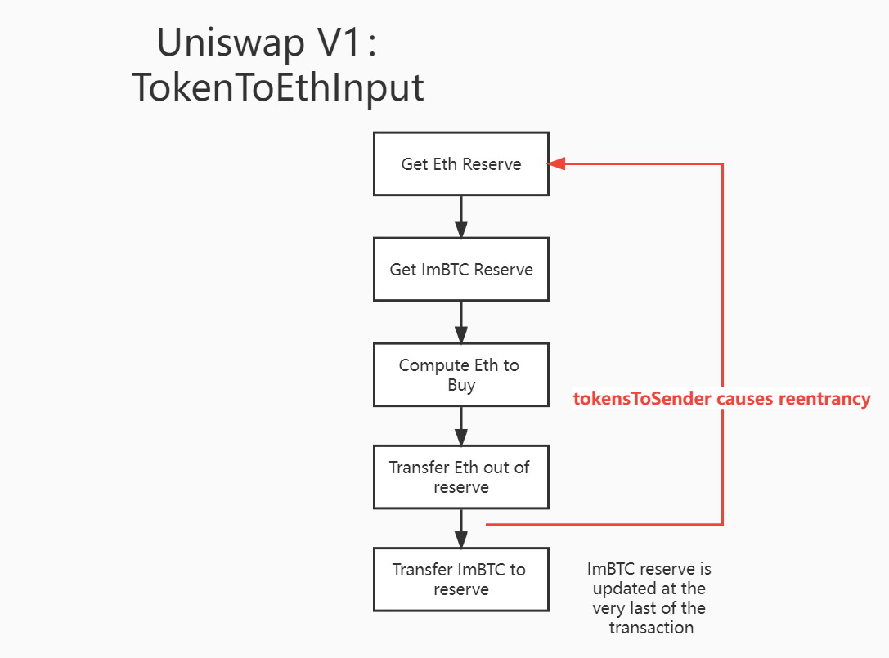

# Background
In 2020 April 18th, Uniswap(V1) is drained by reentrancy attack. This exchange hosts an ImBTC-Eth pair where ImBTC is an ERC777 token.

Here I present a demo illustrating how this attack is engaged.

# How to use
```
npm install
npx hardhat test
```

# Explanation
It is possible to conduct a reentrancy attack on an UniswapV1 exchange hosting ERC777-Eth pair.To do this , create an attacker contract contains the following methods:

- prepare: approve attacker to operate its ERC777 assets && adding hooks on ERC1820
- trigger: a payable function that :
  - receives some ether
  - buy  ERC777 through uniswap
  - sell a fraction of ERC777  to ether through uniswap exchange that will transfer ether to attacker contract and take ERC777 from attacker contract to uniswap exhange
- tokenToSend: This is the receiver function called by ERC777. It will sell a fraction of ERC777 to ether through uniswap exchange. 
- withdraw: called to claim the profits.

Now, when the contract is "triggered", here is what happens:

- 1) The attack contract receives ether to buy ERC777 token by calling "uni.ethToTokenInput"
- 2) The attack contract tried to exchange part of its ERC777 by calling "uni.tokenToEthInput"
- 3) The uniswap exchange compute the eth to buy through "getInputPrice"
- 4) The uniswap exchange transfer that eth to attack contract.
- 5) Before uniswap exchange modify balances of ERC777, ERC777 notify the token sender, who is attack contract in this case, by calling the hook function "tokenToSend"
- 6) The attack contract reenter into "tokenToEthInput" of uniswap exchange in "tokenToSend"
- 7) Step 3~6 is repeated, causing many micro swaps, untils it reaches the maximum count of reentrancies.

# Deep dive
## Basics of uniswap: constant K principle
To deeper understand how the attack works, let's recap the basics of uniswap.

In theory, when we exchange ERC777 for ether, the amount of ether bought can be conducted following the rule of constant K:

$$
\left ( X_{ImBTC} + ΔX_{ImBTC} \right ) \left (Y_{Eth} - ΔY_{Eth} \right) = X_{ImBTC}Y_{Eth}
$$

So

$$
ΔY_{Eth} = \frac{ΔX_{ImBTC}\times Y_{Eth}}{X_{ImBTC} + ΔX_{ImBTC}} 
$$

And here is the code:

``` solidity
    //Note: To illustrate clearly I've ignore the fee parts
    function getInputPrice(uint256 input_amount, uint256 input_reserve, uint256 output_reserve) internal pure returns(uint256){
        input_amount = input_amount;
        uint256 nominator = input_amount * output_reserve;
        uint256 denominator = input_amount + input_reserve;
        return nominator / denominator;
    }

```
## Basics of uniswap: process of swap

A "swap" process basiclly comprises several steps:

- 1) Get Eth reserve 
- 2) Get ImBTC reserve
- 3) Compute the eth to bought following "Constant K principle"
- 4) Modify Eth reserve
- 5) Modify ImBTC reserve

``` solidity
    function tokenToEthInput(uint256 token_sold) external returns(uint256){
        uint256 eth_reserve = address(this).balance;
        uint256 token_reserve = erc20.balanceOf(address(this));
        uint256 eth_bought = getInputPrice(token_sold, token_reserve, eth_reserve);
        payable(msg.sender).transfer(eth_bought);
        require(erc20.transferFrom(msg.sender, address(this), token_sold), "UniV1: Transfer failed");
        
        return eth_bought;
    }
```

Specially, a swap process could split into arbitrary sub swap process, yielding the same final result.

## Reentrancy

ERC777 allows for notifying the sender before the balance if modified, which compromises the "Check-Effects-Interaction" pattern:

``` solidity
       _callTokensToSend(operator, from, to, amount, userData, operatorData);

        _move(operator, from, to, amount, userData, operatorData);

        _callTokensReceived(operator, from, to, amount, userData, operatorData, requireReceptionAck);
```

Hence, a reentrancy is formed, causing many micro swaps:



As the reentrancy compromises the consitency of swap process, each time a micro swap is executed without change of ImBTC reserve, causing a little bit more eth is swapped out. 

More formally, under normal circumstance, after a miscro swap process, ImBTC pool is increased while  the Eth pool is decreased, making Eth more valuable for next swap; However, under this reentrancy circumstance, after a micro swap process, ImBTC pool is NOT increased though the Eth pool is decreased, making Eth NOT that valueble for next swap. 

test/sample-test.js gives a comparison of swap process  splitted into 10 micro swaps under different scenarios .We can see that after the first swap, the swap from reentrancy could swap a little bit more ETH than normal swaps:


``` plain python

## Normal cases
[Before swap]poolX: 1000.0
[Before  swap]poolY: 1000.0
xSold: 10.0
splits:  10
yBoughts:9.900990099009900984
[yBought] 0.999000999000999
[yBought] 0.997006985030937126
[yBought] 0.995018935210337052
[yBought] 0.993036825777647138
[yBought] 0.991060633089532417
[yBought] 0.98909033362016953
[yBought] 0.987125903960546551
[yBought] 0.985167320817767689
[yBought] 0.983214561014362798
[yBought] 0.981267601487601683
[After swap]poolX: 1010.0
[After swap]poolY: 990.099009900990099016

## Under attack cases

[Before swap]poolX: 1000.0
[Before  swap]poolY: 1000.0
xSold: 10.0
splits:  10
yBoughts:9.945219286997006409
[yBought] 0.999000999000999
[yBought] 0.998002996004994006
[yBought] 0.997005990014979027
[yBought] 0.996009980034944083
[yBought] 0.995014965069874209
[yBought] 0.994020944125748461
[yBought] 0.993027916209538922
[yBought] 0.992035880329209712
[yBought] 0.991044835493715996
[yBought] 0.990054780713002993
[After swap]poolX: 1010.0
[After swap]poolY: 990.054780713002993591
```

We can see from above that under reentrancy attack, user could get 9.945219286997006409 eth rather than 9.900990099009900984, with each micro swap buying  a little bit more than normal cases.

Please refer to sample-test.js for more details.

## How to avoid
Uniswap V2 adds a reemtrancy lock to avoid this kind of attack:

``` solidity
    uint private unlocked = 1;
    modifier lock() {
        require(unlocked == 1, 'UniswapV2: LOCKED');
        unlocked = 0;
        _;
        unlocked = 1;
    }

    function swap(uint amount0Out, uint amount1Out, address to, bytes calldata data) external lock {
        //...
    }
```

You may think that we can also change the order of transfers, making ImBTC transfers before Eth transfer:

``` solidity
    function tokenToEthInput(uint256 token_sold) external returns(uint256){
        uint256 eth_reserve = address(this).balance;
        uint256 token_reserve = erc20.balanceOf(address(this));
        uint256 eth_bought = getInputPrice(token_sold, token_reserve, eth_reserve);
        
        require(erc20.transferFrom(msg.sender, address(this), token_sold), "UniV1: Transfer failed");
        payable(msg.sender).transfer(eth_bought);
        return eth_bought;
    }
``` 
This is not acceptable, as each swap by reentrancy is executed without any changes to either ETh reserve or ImBTC reserve, causing it more vunerable to reentrancy attack. You could modify UniV1Simple.sol to verify this conclusion.

# More
In sample-test.js, you can try to investigate how to maximize the profits of attacks by different parameters. As in my experiment,  it basiclly shows that:

- More micro swaps leads to more profits.
- Bigger input amount  leads to more profits.
- The ratio between pool affects the profits.
- ...

# Reference
https://etherscan.io/tx/0x32c83905db61047834f29385ff8ce8cb6f3d24f97e24e6101d8301619efee96e

https://blockcast.it/2021/08/31/amber-group-reentrancy-attack-explained/

https://zhuanlan.zhihu.com/p/404184586

https://defirate.com/news

https://github.com/OpenZeppelin/exploit-uniswap#exploit-details

https://medium.com/imtoken/about-recent-uniswap-and-lendf-me-reentrancy-attacks-7cebe834cb3

https://paper.seebug.org/1182/

https://medium.com/imtoken/about-recent-uniswap-and-lendf-me-reentrancy-attacks-7cebe834cb3


