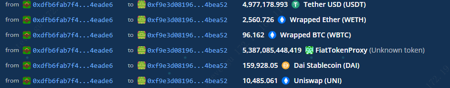
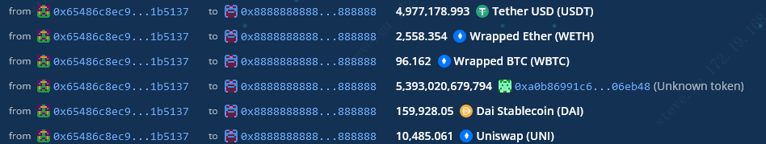

## 概述
---
2021 年 8月 3 日，Popsicle Finance被攻击，损失2000w美元
---
## 事件分析


* 攻击合约
```
0xf9E3D08196F76f5078882d98941b71C0884BEa52
```

* 攻击交易

```
https://etherscan.io/tx/0xcd7dae143a4c0223349c16237ce4cd7696b1638d116a72755231ede872ab70fc
```

- 截图

​       攻击者：



​         复现：


